# Todo Management GUI デプロイガイド

[English](DEPLOY_GUIDE_GUI.md) | [简体中文](DEPLOY_GUIDE_GUI-zh_CN.md) | [日本語](DEPLOY_GUIDE_GUI-ja_JP.md)

このガイドは、初心者向けの Azure Portal ベース (GUI ファースト) のデプロイ手順を説明します。ワークショップまたは初回デプロイに使用してください。

所要時間の目安: 45 分から 60 分。

---

## 用語統一標準 (EN/JA/ZH)

3 言語版で次の用語を統一して使用します:

- Microsoft Entra ID
- Azure Container Apps Environment
- Instructor-provided container image

補足:

- API Container App の環境変数では、`USER_ASSIGNED_IDENTITY_CLIENT_ID` は PostgreSQL 認証に使用するユーザー割り当てマネージド ID の Client ID を意味します。
- Web サインインでは、講師から提供された、またはこのガイドで作成した Microsoft Entra ID アプリケーションの Client ID と tenant/authority 値を使用します。

---

## ワークフロー概要

このガイドは次のフェーズで構成されています:

1. **フェーズ 1: 準備** - 講師から提供されたコンテナーイメージと値を確認します
2. **フェーズ 2: Azure インフラストラクチャセットアップ** (Portal 経由) - 必要な Azure リソースを作成し、準備済みイメージをデプロイします
3. **フェーズ 3: 検証** - Redirect URI を追加し、デプロイ済みアプリケーションをテストします

IaC/Bicep パスについては、`DEPLOY_GUIDE.md` (上級トラック) を参照してください。

---

## 前提条件

- Azure サブスクリプション権限: `Owner`
- 講師 ACR の Owner ロール。これにより、現在サインインしている Azure Portal アカウントが Container App の system-assigned identity に `AcrPull` を付与できます
- Microsoft Entra ID でアプリ登録を作成するための権限:
  - `Application Administrator`、`Cloud Application Administrator`、または `Application Developer` ロール
  - 組織がすべてのユーザーにアプリ登録を許可している場合 (デフォルト設定)、特別なロールは不要です
  - 参考: [Least privileged roles by task - Microsoft Entra ID (MS Learn)](https://learn.microsoft.com/entra/identity/role-based-access-control/delegate-by-task)

講師から次のコンテナーイメージ情報を収集します:

- API image name and tag
- Web image name and tag
- Registry login server

ワークショップ参加者向けの重要な注意事項:

- 開始前に名前、リージョン、必要な ID を準備してください
- この初心者向けガイドでは、ワークショップ中に GitHub Actions、Repository variables、コンテナーイメージのビルドは不要です
- 講師は、教室環境に対応したイメージを事前に準備してテストしておく必要があります。特に、簡略化された Web イメージは Container App の環境変数から Microsoft Entra ID 設定を読み取れる必要があります。

---

## フェーズ 1: 準備

> 所要時間の目安: 5 分

Azure リソースを作成する前に、講師からイメージと構成値を収集します。

| 項目 | 例 | 補足 |
| ---- | -- | ---- |
| API image | `instructoracr.azurecr.io/todomanagement-api:latest` | API Container App で使用します |
| Web image | `instructoracr.azurecr.io/todomanagement-web:latest` | Web Container App で使用します |
| Registry login server | `instructoracr.azurecr.io` | イメージ選択時に必要です |
| Web authentication variable names | 講師から提供 | このガイドでは `VITE_AZURE_CLIENT_ID` と `VITE_AZURE_AUTHORITY` を使用します。`VITE_AZURE_REDIRECT_URI` は省略可能で、現在の Web App URL が既定値になります。 |

> 講師向けメモ: ハンズオンを簡単にするため、ワークショップ前に API と Web の両方のイメージを準備してテストしてください。ACR remote build の準備手順については [INSTRUCTOR_PREP_GUIDE.md](INSTRUCTOR_PREP_GUIDE.md) を参照してください。この簡略化された Portal フローでは、学習者が Container App 作成時に値を入力できるよう、Web イメージは実行時環境変数から Microsoft Entra ID 設定を読み取る必要があります。

---

## フェーズ 2: Azure Portal からインフラストラクチャを作成

> 所要時間の目安: 30-40 分

Azure Portal からすべての Azure リソースを作成します。準備済みイメージを Container Apps に直接デプロイします。

> 注意: Portal の表示言語が日本語または中国語の場合、英語名で検索しても一部のサービスが表示されないことがあります。その場合は UI に表示されているローカライズ済みサービス名で検索してください。
> 例: `Resource groups` / `リソース グループ` / `资源组`, `Virtual networks` / `仮想ネットワーク` / `虚拟网络`, `Container Apps` / `コンテナー アプリ` / `容器应用`

### アーキテクチャ概要

次の図は、すべてのコンポーネントが Azure 環境にどのようにデプロイされるかを示しています:

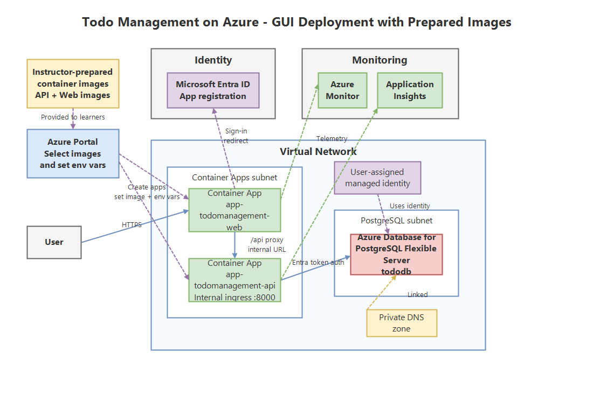

**アーキテクチャの特徴:**

- ユーザーは Container Apps を通じて Web アプリケーションにアクセスします
- Web と API コンテナーは、Virtual Network 内の同じ Container Apps Environment で実行されます
- API は managed identity を使用して PostgreSQL データベースに安全にアクセスします
- 講師から提供されたコンテナーイメージを Container Apps に直接デプロイします
- すべてのネットワークトラフィックは Virtual Network 内のサブネットを通ります
- Microsoft Entra ID がユーザー認証を処理します

---

### リソース作成順序

適切なネットワーク構成を確保するため、次の順序でリソースを作成します:

1. Resource Group
2. Virtual Network とサブネット
3. User-assigned managed identity (API 用)
4. Azure Database for PostgreSQL Flexible Server
5. Microsoft Entra ID app registration (Web サインイン用)
6. Azure Container Apps Environment と Container Apps

---

### ステップ 2.1: Resource Group を作成

参考: [Create resource groups - Azure Portal (MS Learn)](https://learn.microsoft.com/en-us/azure/azure-resource-manager/management/manage-resource-groups-portal#create-resource-groups)

1. Azure Portal で **Home** > **Resource groups** に移動します
2. **Create** をクリックします
3. **Create a resource group** ページで:
   - **Subscription**: サブスクリプションを選択します
   - **Resource group**: 名前を入力します (例: `rg-todomanagement-dev`)
   - **Region**: リージョンを選択します (例: `Japan East`)
4. **Review + Create** -> **Create** をクリックします
5. デプロイが完了するまで待ちます (通常 1-3 秒)

> 次: 後続ステップのために Resource Group 名をメモします

---

### ステップ 2.2: Virtual Network とサブネットを作成

参考: [Create a virtual network - Azure Portal (MS Learn)](https://learn.microsoft.com/en-us/azure/virtual-network/quick-create-portal)

Virtual Network はリソースのための分離されたネットワーク空間を提供します。ワークロードごとに複数のサブネットを作成します。

1. Azure Portal で **Home** > **Virtual networks** を検索します
2. **Create** をクリックします
3. **Create virtual network** ページで:

   - **Subscription**: サブスクリプションを選択します
   - **Resource group**: ステップ 2.1 の Resource Group を選択します
   - **Name**: 名前を入力します (例: `vnet-todomanagement-dev`)
   - **Region**: Resource Group と同じリージョン (例: `Japan East`)
4. **Next** をクリックします
5. **Next** をクリックして **Security** 設定をスキップします
6. Address Space を構成します
   1. **IPv4 address space** で以下を設定します:
      - **Address space**: `10.0.0.0/16` (65,536 個の IP アドレスを提供)

   2. サブネットを作成します

**Add a subnet** をクリックし、2 つのサブネットを作成します:

#### サブネット 1: Container Apps subnet

- **Name**: `snet-container-apps`
- **Subnet address range**: `10.0.1.0/24` (256 アドレス)
- **Private subnet**: 選択しない
- **Subnet Delegation**: `Microsoft.App/environments`
- **Other settings**: デフォルトのままにします
- **Add** をクリックします

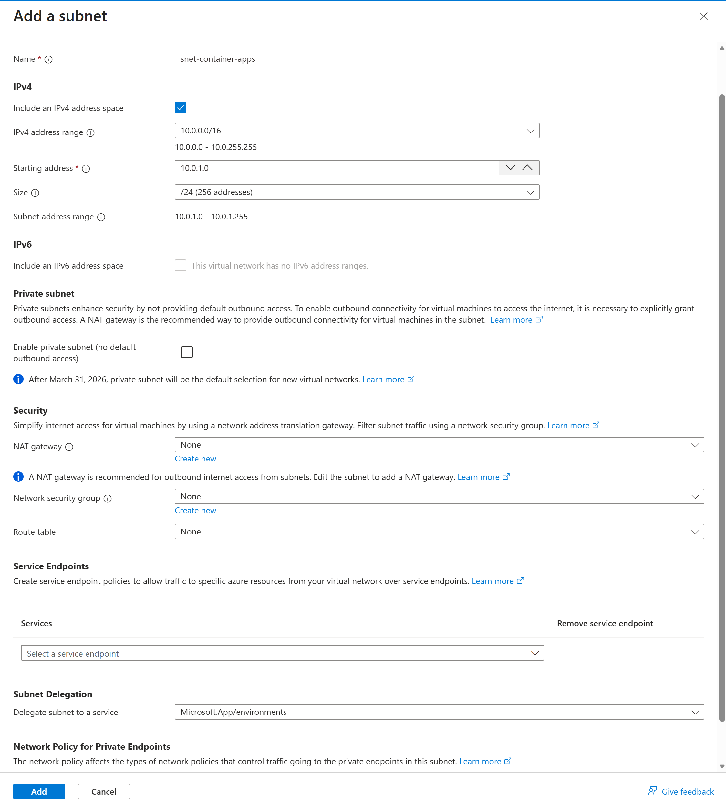

#### サブネット 2: PostgreSQL subnet

- **Name**: `snet-postgresql`
- **Subnet address range**: `10.0.2.0/24` (256 アドレス)
- **Subnet Delegation**: `Microsoft.DBforPostgreSQL/flexibleServers`
- **Other settings**: デフォルトのままにします
- **Add** をクリックします

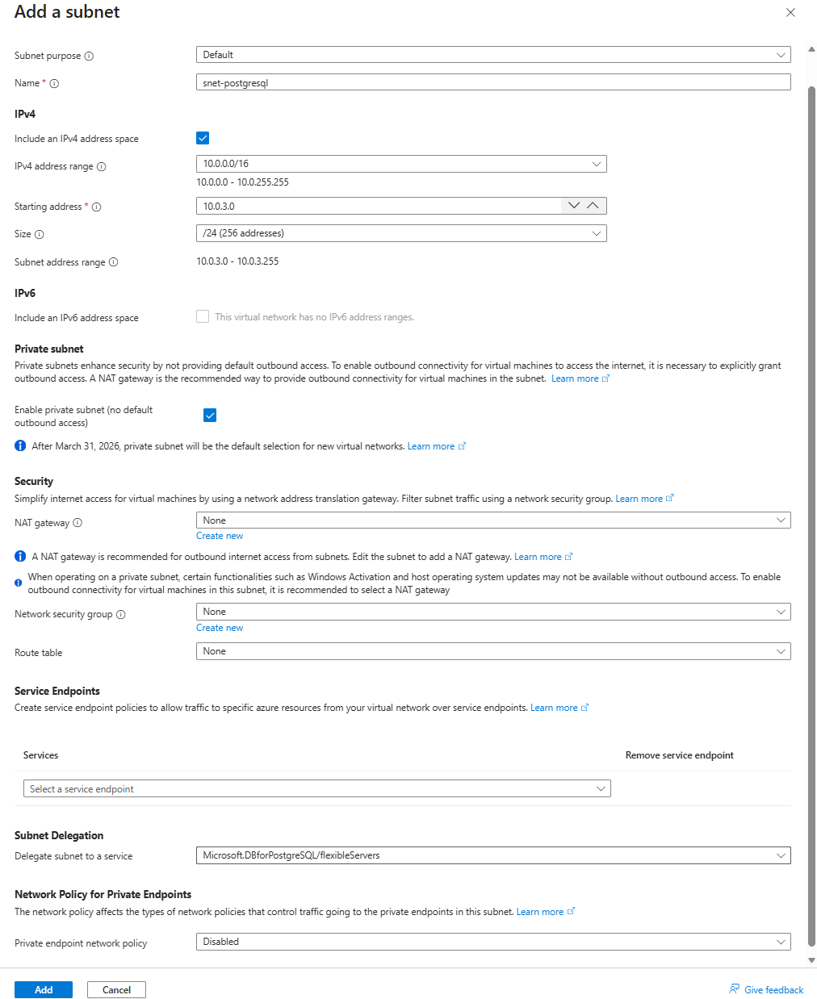
7. 2 つのサブネットを追加したら、**Review + create** -> **Create** をクリックします
8. Virtual Network のデプロイが完了するまで待ちます (通常 5-10 秒)

次: VNet 名とサブネット名をメモします

> **リソース作成時にサブネットを参照してください:**
>
> - Container Apps Environment -> `snet-container-apps`
> - PostgreSQL Flexible Server -> `snet-postgresql`

---

### ステップ 2.3: User-Assigned Managed Identity を作成

参考: [Create a user assigned managed identity - Azure Portal (MS Learn)](https://learn.microsoft.com/en-us/azure/active-directory/managed-identities-azure-resources/how-manage-user-assigned-managed-identities?tabs=azure-portal)

この identity は API コンテナーが PostgreSQL にアクセスするために使用します。

1. Azure Portal で **Home** > **Managed Identities** を検索します
2. **Create** をクリックします
3. **Create User Assigned Managed Identity** ページで:
   - **Subscription**: サブスクリプションを選択します
   - **Resource group**: ステップ 2.1 の Resource Group を選択します
   - **Region**: Resource Group と同じリージョン
   - **Name**: 名前を入力します (例: `uai-todomanagement-api`)
     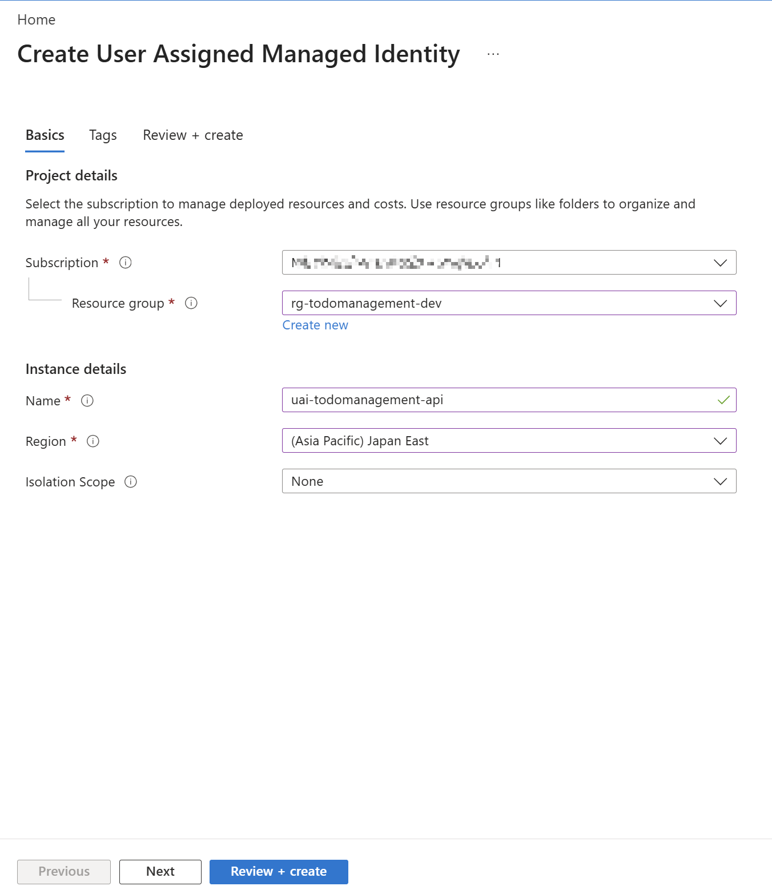
4. **Review + Create** -> **Create** をクリックします
5. デプロイが完了するまで待ちます (通常 1-5 秒)
6. 新しく作成した managed identity をクリックして開きます

**次: メモする値:**

- **Client ID** (Overview)

---

### ステップ 2.4: Azure Database for PostgreSQL Flexible Server を作成

参考: [Create a server - Azure Database for PostgreSQL Flexible Server (MS Learn)](https://learn.microsoft.com/en-us/azure/postgresql/flexible-server/quickstart-create-server-portal)

1. Azure Portal で **Home** > **Azure Database for PostgreSQL flexible servers** を検索します
2. **Create** をクリックします
3. **Create Azure Database for PostgreSQL Flexible Server** ページで:
   - **Subscription**: サブスクリプションを選択します
   - **Resource group**: ステップ 2.1 の Resource Group を選択します
   - **Server name**: 名前を入力します (例: `pg-todomanagement-dev`)
   - **Region**: Resource Group と同じリージョン
   - **PostgreSQL version**: `17` を選択します
   - **Workload type**: `Dev/Test` を選択します
   - **Compute + storage**: 開発用としてデフォルトのままにします
   - **Authentication method**: `Microsoft Entra authentication only` を選択します
   - **Microsoft Entra administrator**: 自分のユーザーを選択します。
     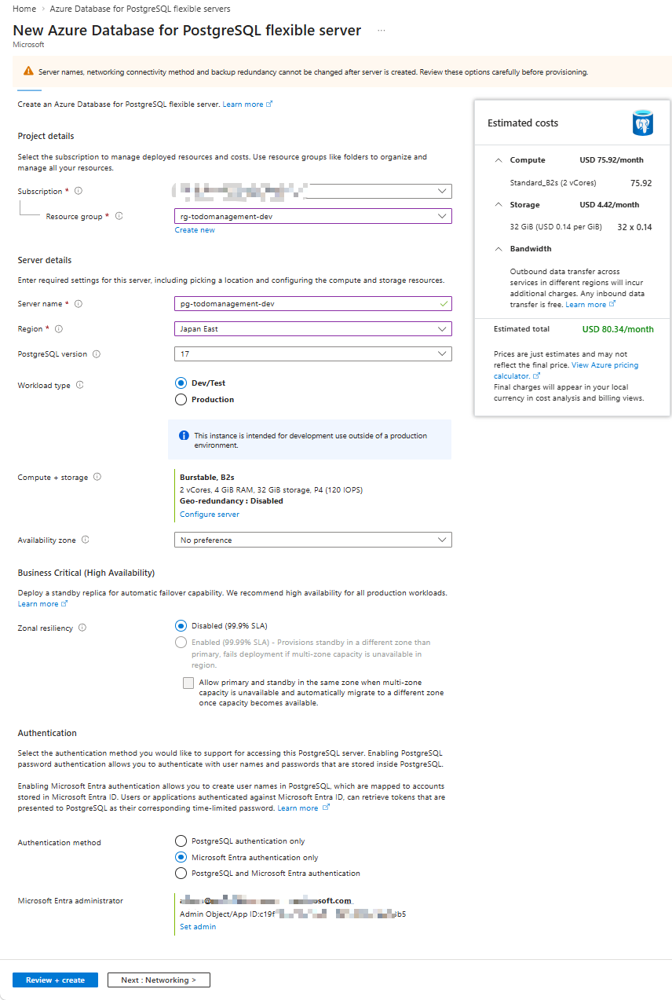
4. **Next: Networking** をクリックします
5. **Networking** ページで:
   - **Connectivity method**: `Private access (VNet Integration)` を選択します (セキュリティ上推奨)
   - **Virtual network**:
     - **Subscription**: サブスクリプションを選択します
   - **Virtual network**: ステップ 2.2 の VNet を選択します (例: `vnet-todomanagement-dev`)
   - **Subnet**: `snet-postgresql` を選択します (ステップ 2.2)
   - **Private DNS integration**:
     - **Subscription**: サブスクリプションを選択します
     - **Private DNS zone**: `(New) privatelink.postgres.database.azure.com` を選択します。同名の private zone がすでに存在する場合、Azure は `(New) pg-todomanagement-dev.private.postgres.database.azure.com` のような zone を表示することがあります。
       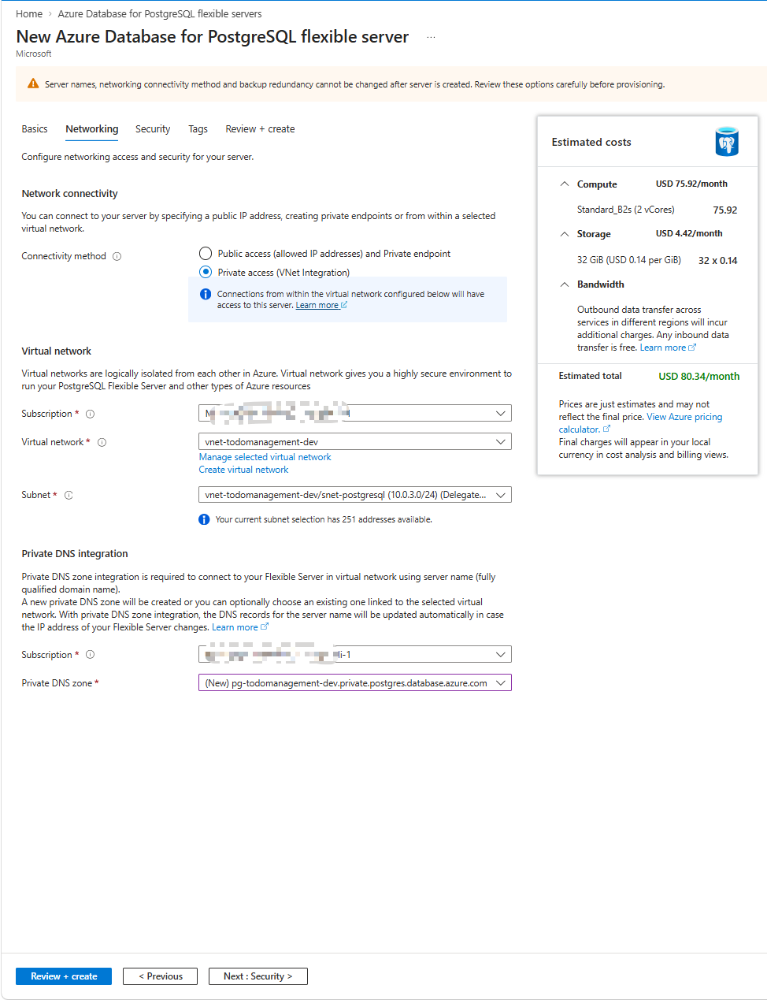
6. **Review + Create** -> **Create** をクリックします
7. デプロイが完了するまで待ちます (通常 5-10 分)

**次: メモする値:**

- PostgreSQL server endpoint (例: `pg-todomanagement-dev.postgres.database.azure.com`)

---

### ステップ 2.5: PostgreSQL データベースと権限を構成

参考: [Configure server parameters - Azure Database for PostgreSQL (MS Learn)](https://learn.microsoft.com/en-us/azure/postgresql/flexible-server/concepts-server-parameters)

1. Azure Portal で、ステップ 2.4 の PostgreSQL server に移動します
2. 左側メニューで **Databases** をクリックします
3. **Add** をクリックします
4. データベース名として `tododb` を入力します
5. **Save** をクリックします
6. データベース作成が完了するまで待ちます (通常 1-2 分)

**Managed Identity に PostgreSQL データベースへのアクセスを付与:**

1. Azure Portal で PostgreSQL server に移動します
2. 左側メニューで **Security** -> **Authentication** をクリックします
3. **Add Microsoft Entra administrators** をクリックします。**Select Microsoft Entra administrators** ダイアログで、ステップ 2.3 で作成した managed identity (例: `uai-todomanagement-api`) を検索し、**Select** をクリックします
   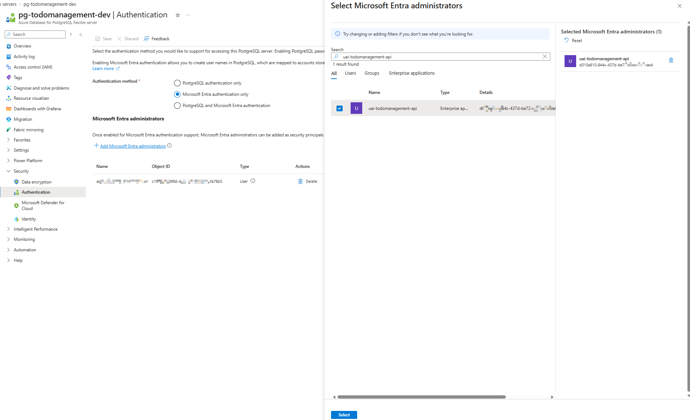
4. **Save** をクリックし、構成が反映されるまで待ちます

> 注: 最小権限のデータベースロール設計は、このハンズオンガイドの範囲外です。Microsoft Entra principal のデータベースユーザー作成とロール付与に関する本番向けガイダンスは [Manage Microsoft Entra Users - Azure Database for PostgreSQL | Microsoft Learn](https://learn.microsoft.com/en-us/azure/postgresql/security/security-manage-entra-users) を参照してください。

---

### ステップ 2.6: Microsoft Entra ID App Registration を作成

参考: [Register an application - Microsoft Entra ID (MS Learn)](https://learn.microsoft.com/en-us/azure/active-directory/develop/quickstart-register-app)

Web Container App を作成する前に app registration を作成します。これにより、Container App 作成時に client ID と tenant 情報を環境変数として入力できます。最終的な Redirect URI は、Web Container App URL が利用可能になってから追加します。

1. Azure Portal で **Microsoft Entra ID** を開きます (または検索します)
2. 左側メニューで **App registrations** をクリックします
3. **New registration** をクリックします
4. **Register an application** ページで:
   - **Name**: 名前を入力します (例: `todo-web-app`)
   - **Supported account types**: **Accounts in this organizational directory only** を選択します
   - **Redirect URI**: ここでは空のままにします。Web Container App URL 作成後、ステップ 3.2 で追加します。
5. **Register** をクリックします
   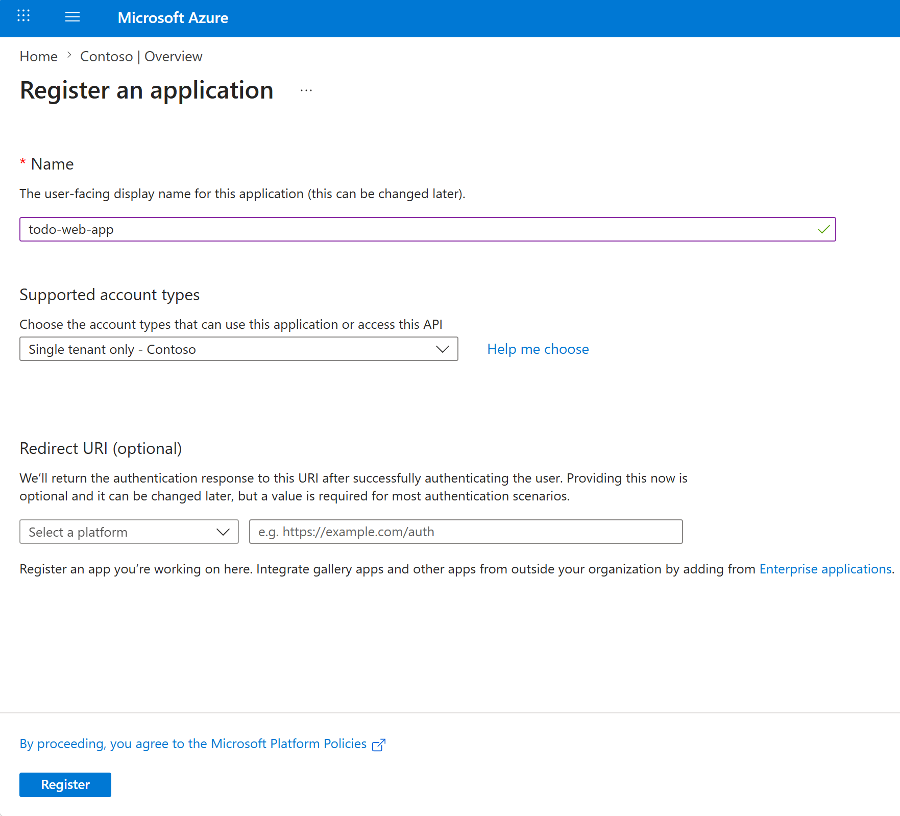
6. アプリ登録が完了しました。次をメモします:
   - **Application (client) ID** (Overview ページ)
   - **Directory (tenant) ID** (Overview ページ)

---

### ステップ 2.7: 講師イメージから API Container App を作成

参考: [Create your first container app with Container Apps - Azure Portal (MS Learn)](https://learn.microsoft.com/en-us/azure/container-apps/quickstart-portal)

先に API Container App を作成します。このステップでは Container Apps Environment も作成されます。

> 推奨: Container App 名は `app-todomanagement-api` と `app-todomanagement-web` のままにしてください。別の名前を使用する場合は、後続ステップで入力する値も更新してください。

1. Azure Portal で **Home** > **Container Apps** を検索します
2. **Create** > **Container App** をクリックします
   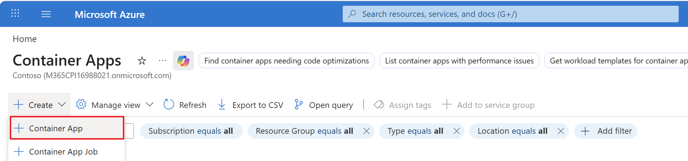
3. **Basics** ページで:

   - **Project details**:
     - **Subscription**: サブスクリプションを選択します
     - **Resource group**: ステップ 2.1 の Resource Group を選択します
     - **Container app name**: `app-todomanagement-api` を入力します
     - その他の設定はデフォルトのままにします
       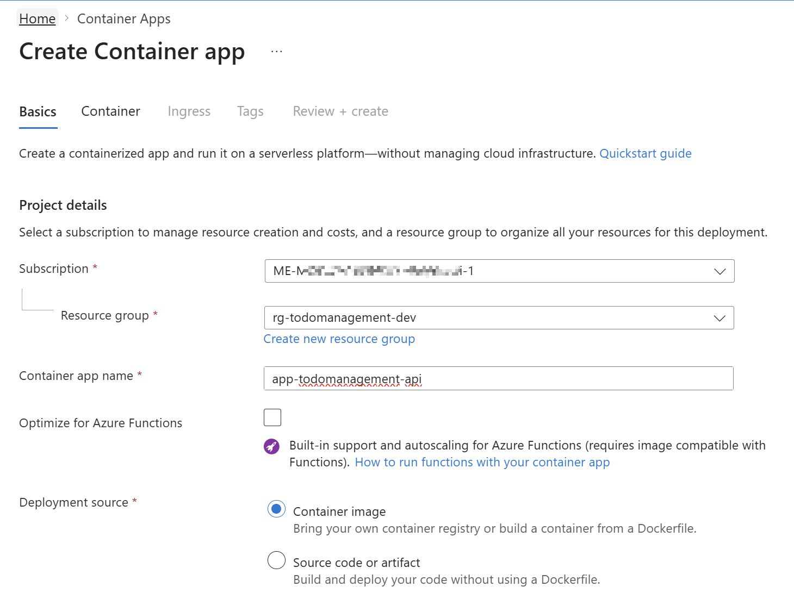
   - **Container Apps environment**:
     - **Region**: Resource Group と同じリージョン
     - **Container Apps environment** で **Create new environment** をクリックします
       **Create Container Apps environment** ダイアログで:
       1. **Basics** ページで:

          - **Environment name**: 名前を入力します (例: `cae-todomanagement-dev`)
          - その他の設定はデフォルトのままにします
       2. **Monitoring** ページで:

          - **Logs Destination**: **Azure Log Analytics** を選択します
          - **Log Analytics workspace**: **Create new** をクリックします
            - **Name**: 名前を入力します (例: `law-todomanagement-dev`)
            - **OK** をクリックします

          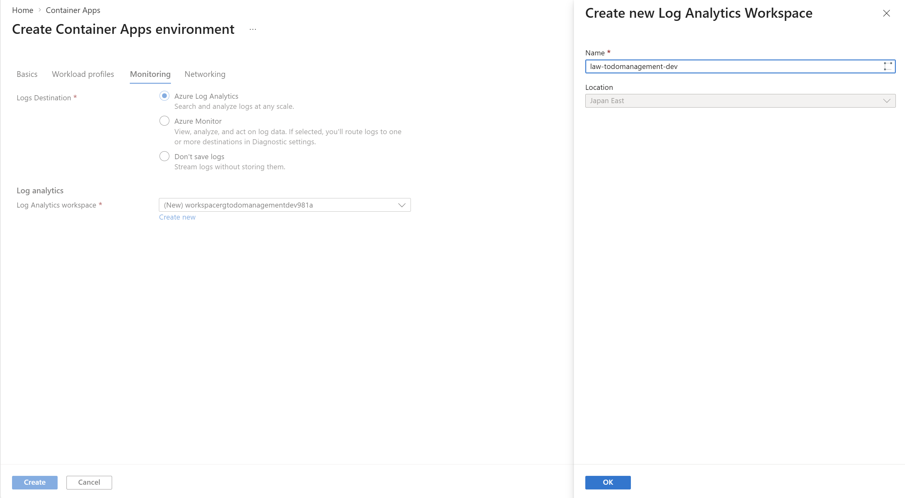
       3. **Networking** ページで:

          - **Public Network Access**: 後続ステップでアプリケーションを検証するため **Enabled** を選択します
          - **Use your own virtual network**: `Yes` を選択し、ステップ 2.2 の virtual network と `snet-container-apps` subnet を指定します
          - その他の設定はデフォルトのままにします

          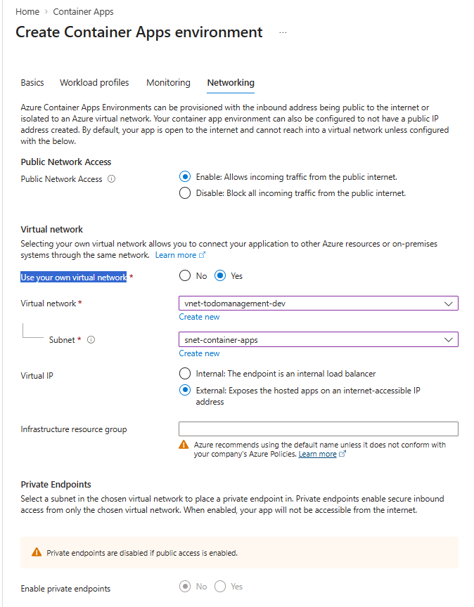
       4. **Create** をクリックします

          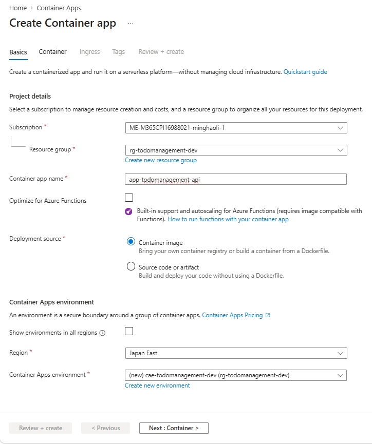
4. **Next: Container** をクリックします
5. **Container** ページで、講師から提供された API image を入力します:

   - **Name**: `app-todomanagement-api` を入力します
   - **Image source**: `Azure Container Registry` を選択します
   - **Image and tag**: 講師から提供された API image と tag を入力します (例: `todomanagement-api:workshop-20260707`)
   - registry authentication には system-assigned managed identity を使用します。registry username/password は入力しません。
   - Portal が registry authentication を求める場合は、`Managed identity` と `System assigned` を選択します。
   - その他の設定はデフォルトのままにします
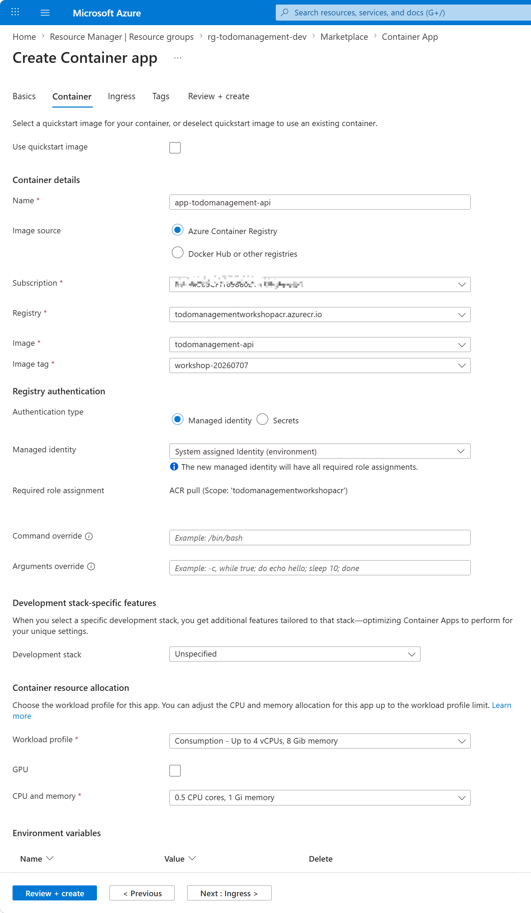

6. API container の環境変数を追加します:

| Name | Value |
| ---- | ----- |
| `USER_ASSIGNED_IDENTITY_CLIENT_ID` | ステップ 2.3 の Managed Identity Client ID |
| `POSTGRES_SERVER` | ステップ 2.4 の PostgreSQL server endpoint |
| `POSTGRES_DB` | `tododb` |
| `POSTGRES_USER` | ステップ 2.3 の Managed Identity 名。例: `uai-todomanagement-api` |
| `DATABASE_TYPE` | `postgresql` |
| `ENVIRONMENT` | `production` |
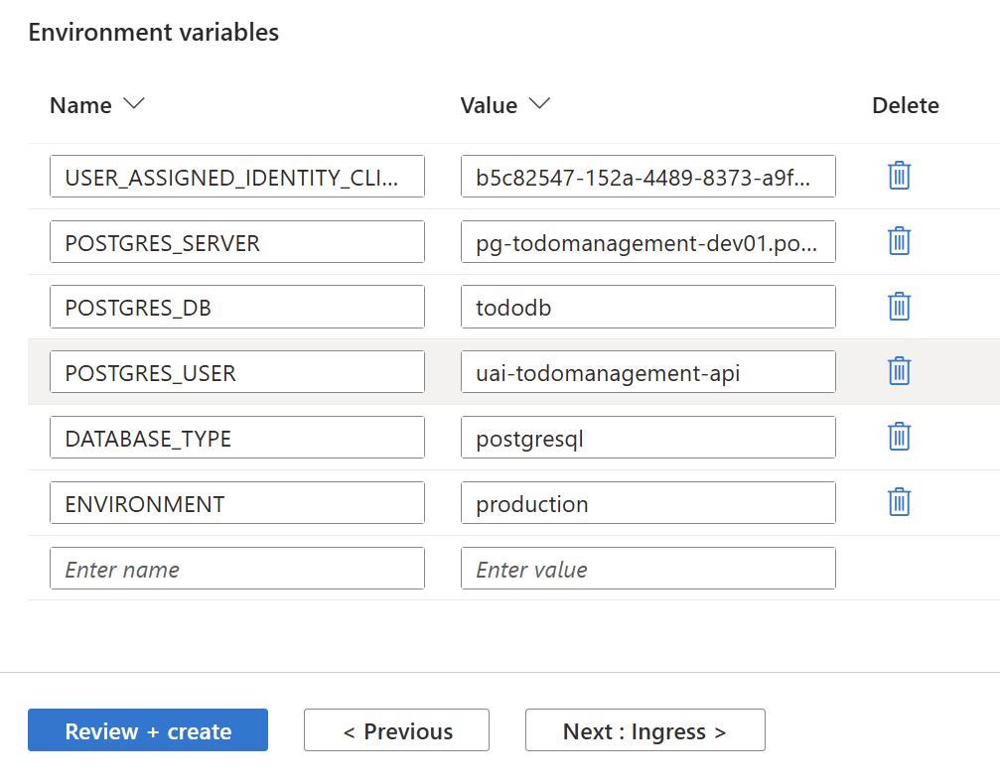

1. **Next: Ingress** をクリックします
2. **Ingress** ページで:
   - **Ingress**: 有効になっていることを確認します
   - **Ingress traffic**: `Limited to Container Apps Environment` を選択します
   - **Target port**: `8000` を入力します
   - その他の設定はデフォルトのままにします
     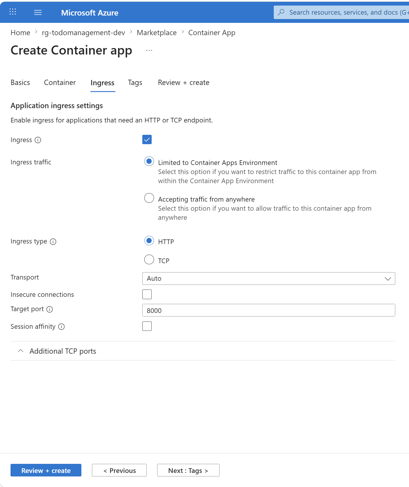
3. **Review + Create** -> **Create** をクリックします
4. デプロイが完了するまで待ちます (通常 4-5 分)
5. デプロイ完了後、**Go to resource** をクリックして作成されたアプリに移動します
6. **Overview** ページで、API app の **Application URL** をメモします (例: `https://app-todomanagement-api.internal.politebay-d0fe95ab.japaneast.azurecontainerapps.io`)

続行する前に、API Container App の **Identity** を開き、**System assigned** が `On` であることを確認します。現在サインインしている Azure Portal アカウント (講師 ACR の Owner 権限を持つ必要があります) を使用し、この **Object (principal) ID** に `AcrPull` を割り当てます。

次: Container Apps Environment 名と API app の Application URL をメモします。

---

### ステップ 2.8: 講師イメージから Web Container App を作成

1. Azure Portal で **Home** > **Container Apps** を検索します
2. **Create** > **Container App** をクリックします
   
3. **Basics** ページで:

   - **Project details**:
     - **Subscription**: サブスクリプションを選択します
     - **Resource group**: ステップ 2.1 の Resource Group を選択します
     - **Container app name**: `app-todomanagement-web` を入力します
     - その他の設定はデフォルトのままにします
   - **Container Apps environment**:
     - **Region**: Resource Group と同じリージョン (例: `Japan East`)
   - **Container Apps environment**: ステップ 2.7 で作成した Container Apps Environment を選択します (例: `cae-todomanagement-dev`)
       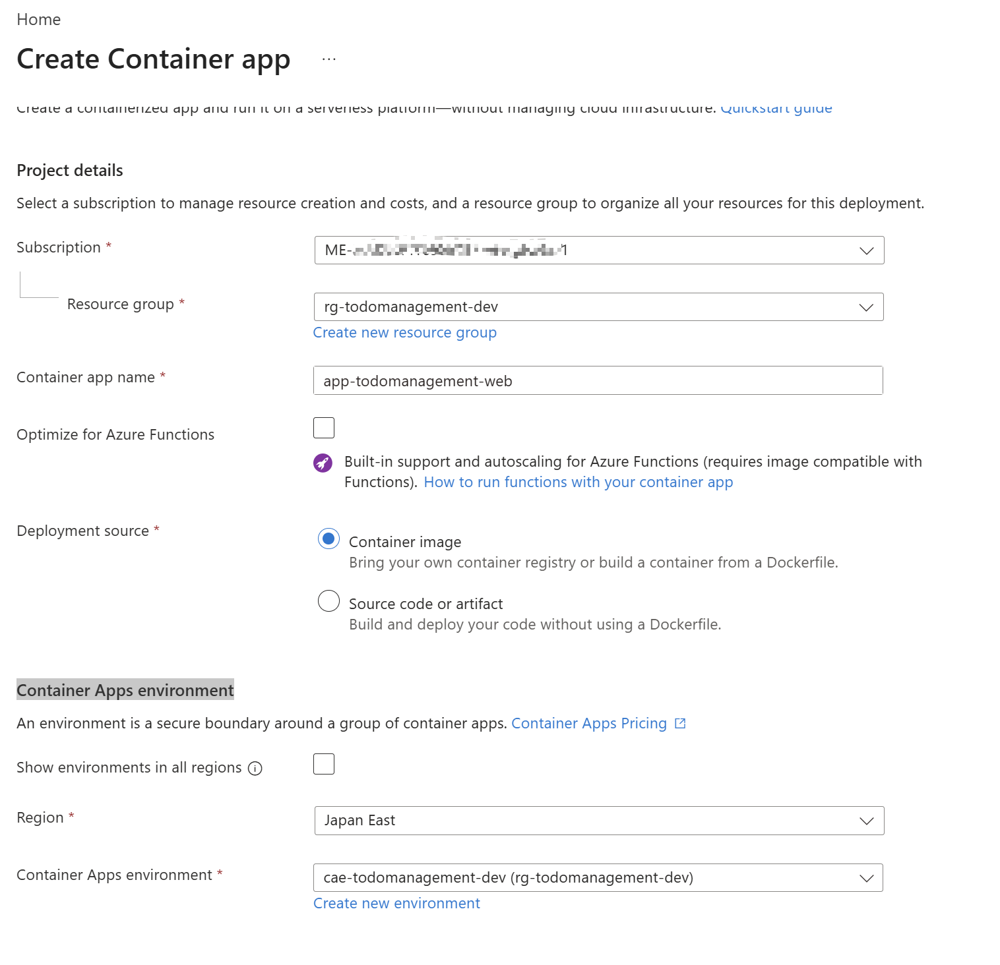
4. **Next: Container** をクリックします
5. **Container** ページで、講師から提供された web image を入力します:

   - **Name**: `app-todomanagement-web` を入力します
   - **Image source**: `Azure Container Registry` を選択します
   - **Image and tag**: 講師から提供された web image と tag を入力します (例: `todomanagement-web:workshop-20260707`)
   - **CPU and memory**: `0.25 CPU cores, 0.5 Gi memory` を選択します
   - registry authentication には system-assigned managed identity を使用します。registry username/password は入力しません。
   - Portal が registry authentication を求める場合は、`Managed identity` と `System assigned` を選択します。

6. Web container に次の環境変数を追加します:
   `API_PROXY_TARGET` にはステップ 2.7 の internal API URL を使用します。

   | Name | Value |
   | ---- | ----- |
   | `API_PROXY_TARGET` | ステップ 2.7 の internal API Container App URL |
   | `VITE_AZURE_CLIENT_ID` | ステップ 2.6 の Entra ID App Client ID |
   | `VITE_AZURE_AUTHORITY` | ステップ 2.6 の Entra ID App Tenant ID を使用した `https://login.microsoftonline.com/<tenant-id>` |

7. **Next: Ingress** をクリックします
8. **Ingress** ページで:

   - **Ingress**: 有効になっていることを確認します
   - **Ingress traffic**: `Accepting traffic from anywhere` を選択します
   - **Target port**: `80` を入力します
   - その他の設定はデフォルトのままにします
     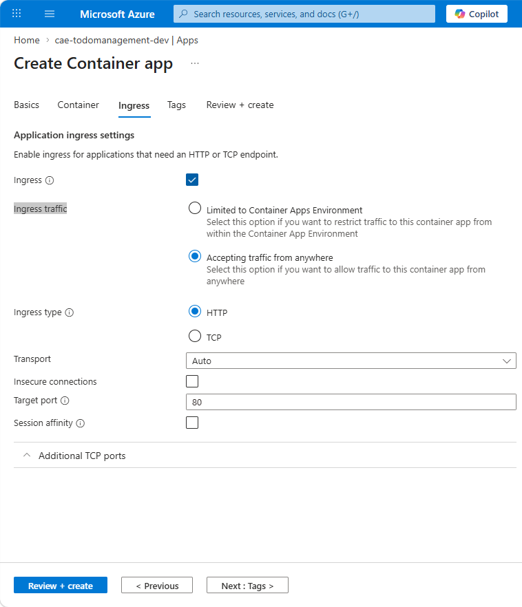
9. **Review + Create** -> **Create** をクリックします
10. デプロイが完了するまで待ちます (通常 1-2 分)
11. デプロイ完了後、**Go to resource** をクリックして作成されたアプリに移動します
12. **Overview** ページで、web app の **Application URL** をメモします (例: `https://app-todomanagement-web.politebay-d0fe95ab.japaneast.azurecontainerapps.io`)

続行する前に、Web Container App の **Identity** を開き、**System assigned** が `On` であることを確認します。現在サインインしている Azure Portal アカウント (講師 ACR の Owner 権限を持つ必要があります) を使用し、この **Object (principal) ID** に `AcrPull` を割り当てます。

次: フェーズ 3 の検証用に web Application URL を保持します。

---

## フェーズ 3: デプロイメントを検証

> 所要時間の目安: 10 分

### ステップ 3.1: Container App デプロイメントを確認

1. Azure Portal で **Container Apps Environment** に移動します
2. 2 つの container app が表示されていることを確認します:
   - `app-todomanagement-api`
   - `app-todomanagement-web`
3. `app-todomanagement-web` をクリックし、web app の **URL** をメモします
4. `app-todomanagement-api` をクリックし、internal API の **URL** をメモします

---

### ステップ 3.2: Entra ID Redirect URI を追加

Web Container App URL が利用可能になったら、Microsoft Entra ID app registration に追加します。

1. **Entra ID App registration** に移動します (ステップ 2.6)
2. **Authentication** をクリックします
3. **Single-page application** の下に、ステップ 3.1 の Web Container App URL を追加します
4. `https://<your-web-url>` を使用します
   - `<your-web-url>` をステップ 3.1 の web app URL に置き換えます
   - `/callback` は追加しません
5. **Save** をクリックします

---

### ステップ 3.3: アプリケーションをテスト

1. ブラウザーで web application URL を開きます
2. **Login** をクリックします
3. Microsoft Entra ID 資格情報でサインインします
4. サインイン後、**Todo List** ページが表示されます
5. 機能をテストします:
   - **Create**: 新しい todo item を追加し、Save をクリックします
   - **Edit**: todo item をクリックして編集します
   - **Delete**: delete ボタンをクリックして todo item を削除します
   - **Refresh**: ページ更新後もすべての変更が保持されます

**ログインに失敗する場合:**

- Entra ID redirect URI が正しいことを確認します
- Web image の Microsoft Entra ID client ID と tenant/authority 構成を講師に確認します
- ブラウザーコンソールのエラー詳細を確認します (F12 > Console)

**API が応答しない場合:**

- PostgreSQL database にアクセスできることを確認します
- managed identity にデータベース権限があることを確認します
- Container Apps の API container logs を確認します

---

## 完了のサマリー

Todo Management アプリケーションが Azure にデプロイされました。

**デプロイされたもの:**

- ✅ todo schema を持つ PostgreSQL database
- ✅ Azure Container Apps 内の API container
- ✅ Azure Container Apps 内の Web container
- ✅ Microsoft Entra ID によるユーザー認証
- ✅ Azure Container Apps で実行される講師提供コンテナーイメージ

**次のステップ:**

- Azure Application Insights でアプリケーションを監視します
- `DEPLOY_GUIDE.md` の IaC アプローチを学習します
- 組織向けにアプリケーションをカスタマイズします

---

## 一般的な問題とトラブルシューティング

### コンテナーイメージを pull できない

**エラー**: Container App revision が起動しない、またはログに image pull error が表示される。

**解決策:**

- image name と tag が講師から提供された値と一致していることを確認します
- registry login server が正しいことを確認します
- Container App system-assigned managed identity に講師 ACR 上の `AcrPull` が付与されていることを確認します
- Container Apps の **Revision management** で最新 revision が active かつ healthy であることを確認します

### API が PostgreSQL に接続できない

**エラー**: `could not translate host name "pg-..." to address`

**解決策:**

- `POSTGRES_SERVER` 変数が PostgreSQL server hostname と完全に一致することを確認します
- PostgreSQL server が正しい VNet、subnet、private DNS zone に接続されていることを確認します
- managed identity に想定されたデータベース権限があることを確認します
- `POSTGRES_USER` が `postgres` ではなく managed identity 名に設定されていることを確認します

### Web ログインが失敗するか、エラーが表示される

**エラー**: `AADSTS50058: Silent sign-in request failed`

**解決策:**

- Web image の Microsoft Entra ID client ID と tenant/authority 構成を講師に確認します
- 開いた web URL が Entra ID に登録された redirect URI と完全に一致することを確認します (ステップ 3.2)
- Entra ID の redirect URI が `https://` scheme であることを確認します

### Container Apps にデプロイメントが表示されない

**エラー**: Container Apps Environment に `app-todomanagement-api` または `app-todomanagement-web` が表示されない

**解決策:**

- 両方の Container Apps が同じ Container Apps Environment に作成されていることを確認します
- 各 app の **Revision management** を確認し、最新 revision が active であることを確認します
- 講師提供の image name と tag が正しく入力されていることを確認します
- `RESOURCE_GROUP` と Container App 名が作成したものと一致していることを確認します

---

## 次のステップ

- **初心者パス完了:** アプリケーションを使用できます!
- **上級パス:** `DEPLOY_GUIDE.md` で Infrastructure as Code を学習します
