# Todo Management GUI 部署指南

[English](DEPLOY_GUIDE_GUI.md) | [简体中文](DEPLOY_GUIDE_GUI-zh_CN.md) | [日本語](DEPLOY_GUIDE_GUI-ja_JP.md)

本指南说明了初学者友好的、基于 Azure Portal (GUI 优先) 的部署路径。用于培训课程或您的首次部署。

预计耗时: 45 到 60 分钟。

---

## 术语统一标准 (EN/JA/ZH 通用)

三语区域统一使用以下术语:

- Microsoft Entra ID
- Repository variables
- Azure Container Apps Environment

说明:

- 本指南中的 `AZURE_CLIENT_ID` 指 Microsoft Entra ID 应用的客户端 ID。
- 本指南中的 `AZURE_TENANT_ID` 指 Microsoft Entra ID 的租户 ID。

---

## 工作流概述

本指南遵循以下阶段:

1. **阶段 1: Azure 基础设施设置** (通过 Portal) - 首先创建所有必需的 Azure 资源
2. **阶段 2: 存储库设置** - 从模板创建存储库
3. **阶段 3: GitHub Actions 配置** - 配置 CI/CD，然后启用工作流并部署
4. **阶段 4: 验证** - 测试部署的应用程序

有关 IaC/Bicep 路径，请参阅 `DEPLOY_GUIDE.md` (高级方案)。

---

## 先决条件

- Azure 订阅权限: `Owner`、或 `Contributor` 加 `User Access Administrator`
- Microsoft Entra ID 应用注册权限:
  - `Application Administrator`、`Cloud Application Administrator` 或 `Application Developer` 角色
  - 如果您的组织允许所有用户注册应用 (默认设置)，则不需要特殊角色
  - 参考: [Least privileged roles by task - Microsoft Entra ID (MS Learn)](https://learn.microsoft.com/entra/identity/role-based-access-control/delegate-by-task)
- GitHub 账户
- 从此模板创建存储库的权限

培训课程参与者重要提示:

- 从模板创建存储库时，在此培训工作流中使用 `Public` 可见性
- `Private` 存储库需要额外的 GitHub 认证和 CI/CD 设置，超出本初学者指南范围
- 事先准备名称、区域和所需 ID
- 在创建存储库前创建 Azure 基础设施，以便您已有 GitHub Actions 所需的值

---

## 阶段 1: 从 Azure Portal 创建基础设施

> 预计耗时: 30-40 分钟

首先创建所有 Azure 资源。稍后您将需要资源 ID 和配置详情来配置 GitHub Actions。

### 架构概述

以下图表显示所有组件如何在您的 Azure 环境中部署:

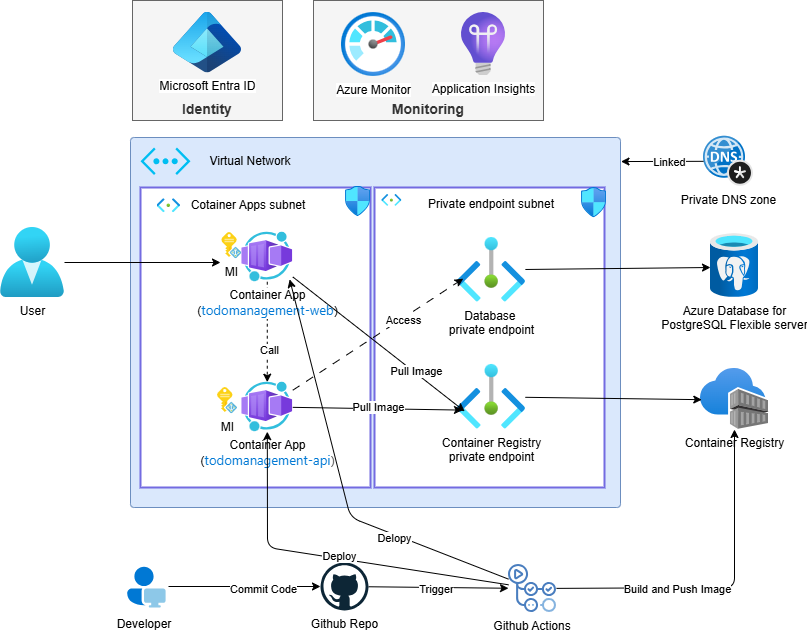

**架构亮点:**

- 用户通过 Container Apps 访问 Web 应用
- Web 和 API 容器在 Virtual Network 内的同一 Container Apps Environment 中运行
- API 使用管理标识安全地访问 PostgreSQL 数据库
- Container Registry 存储容器镜像
- 所有网络流量通过 Virtual Network 内的子网流动
- Microsoft Entra ID 处理用户认证

---

### 资源创建顺序

按此顺序创建资源以确保适当的网络配置:

1. Resource Group
2. Virtual Network 和子网
3. Azure Container Registry (ACR) 和私有端点
4. Azure Container Apps Environment
5. Azure Database for PostgreSQL Flexible Server
6. 用户分配托管标识 (用于 API)
7. Microsoft Entra ID 应用注册 (用于 Web 登录)

---

### 步骤 1.1: 创建 Resource Group

参考: [创建资源组 - Azure Portal (MS Learn)](https://learn.microsoft.com/en-us/azure/azure-resource-manager/management/manage-resource-groups-portal#create-resource-groups)

1. 在 Azure Portal 中导航到 **Home** > **Resource groups**
2. 点击 **Create**
3. 在 **Create a resource group** 页面:
   - **Subscription**: 选择您的订阅
   - **Resource group**: 输入名称 (示例: `rg-todomanagement-dev`)
   - **Region**: 选择一个区域 (示例: `Japan East`)
4. 点击 **Review + Create** -> **Create**
5. 等待部署完成 (通常 1-3 秒)

> 接下来: 记下您的 Resource Group 名称以备后用

---

### 步骤 1.2: 创建 Virtual Network 和子网

参考: [创建虚拟网络 - Azure Portal (MS Learn)](https://learn.microsoft.com/en-us/azure/virtual-network/quick-create-portal)

Virtual Network 为您的资源提供隔离的网络空间。为不同的工作负载类型创建多个子网。

1. 在 Azure Portal 中，进入 **Home** > 搜索 **Virtual networks**
2. 点击 **Create**
3. 在 **Create virtual network** 页面:

   - **Subscription**: 选择您的订阅
   - **Resource group**: 从步骤 1.1 中选择 Resource Group
   - **Name**: 输入名称 (示例: `vnet-todomanagement-dev`)
   - **Region**: 与 Resource Group 相同的区域 (示例: `Japan East`)
4. 点击 **Next**
5. 点击 **Next** 跳过 **Security** 设置
6. 配置地址空间
   1. 在 **IPv4 address space** 下，设置:
      - **Address space**: `10.0.0.0/16` (提供 65,536 个 IP 地址)

   2. 创建子网

点击 **Add a subnet** 并创建三个子网:

#### 子网 1: Container Apps 子网

- **Name**: `snet-container-apps`
- **Subnet address range**: `10.0.1.0/24` (256 个地址)
- **Subnet Delegation**: `Microsoft.App/environments`
- **Other settings**: 保持默认值
- 点击 **Add**

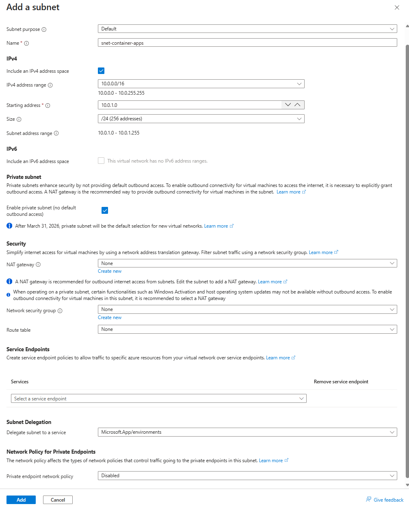

#### 子网 2: 私有端点子网

- **Name**: `snet-private-endpoints`
- **Subnet address range**: `10.0.2.0/24` (256 个地址)
- 保持默认值
- 点击 **Add**


#### 子网 3: PostgreSQL 子网

- **Name**: `snet-postgresql`
- **Subnet address range**: `10.0.3.0/24` (256 个地址)
- **Subnet Delegation**: `Microsoft.DBforPostgreSQL/flexibleServers`
- **Other settings**: 保持默认值
- 点击 **Add**

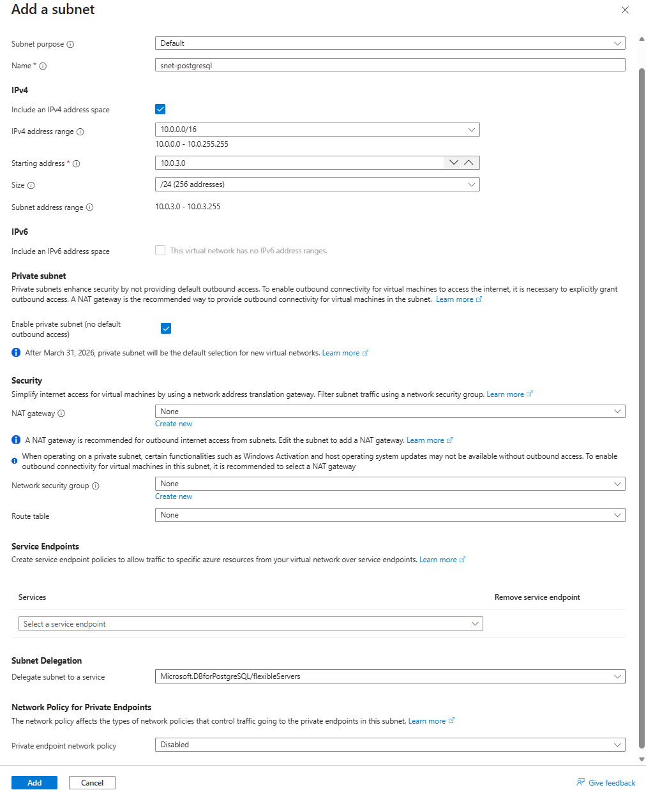
7. 添加所有三个子网后，点击 **Review + create** -> **Create**
8. 等待 Virtual Network 部署 (通常 5-10 秒)

接下来: 记下您的 VNet 名称和子网名称
> **创建资源时参考您的子网:**
> - Container Apps Environment → `snet-container-apps`
> - 私有端点 (ACR、PostgreSQL 可选) → `snet-private-endpoints`
> - PostgreSQL Flexible Server → `snet-postgresql`

---

### 步骤 1.3: 创建 Azure Container Registry (ACR)

参考: [创建容器注册表 - Azure Portal (MS Learn)](https://learn.microsoft.com/en-us/azure/container-registry/container-registry-get-started-portal)

1. 在 Azure Portal 中，进入 **Home** > 搜索 **Container registries**
2. 点击 **Create**
3. 在 **Create container registry** 页面:

   - **Subscription**: 选择您的订阅
   - **Resource group**: 从步骤 1.1 中选择 Resource Group
   - **Registry name**: 输入唯一名称 (示例: `mytodoappacr`)
     - 只能使用小写字母和数字
     - 将用作: `<your-acr-name>.azurecr.io`
   - **Location**: 与 Resource Group 相同的位置 (示例: `Japan East`)
   - **Pricing plan**: 选择 `Premium` (因为我们将使用私有端点访问 ACR)
   - 其他设置保持默认值
4. 点击 **Next: Networking** (配置私有端点)
5. 在 **Networking** 页面:

   - **Connectivity**: 选择 `Private endpoint`
   - 点击 **Add** 创建私有端点
   - 在私有端点创建对话框中:
     - **Name**: `pe-acr`
     - **Subnet**: 从步骤 1.2 中选择 `snet-private-endpoints`
     - **Integrate with private DNS zone**: `Yes`
     - 点击 **OK**
       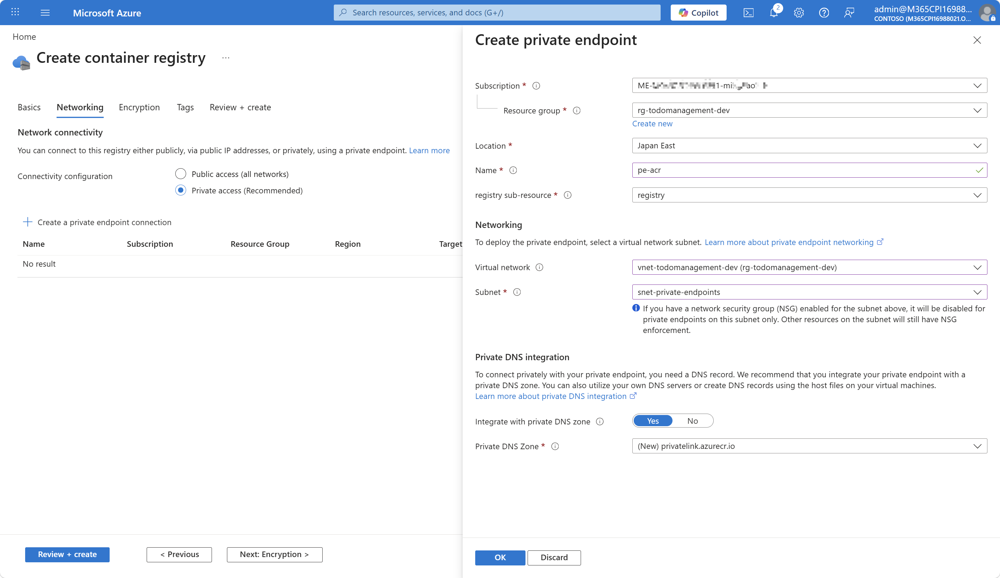
6. 配置好私有端点后，点击 **Review + Create** -> **Create**
7. 等待 ACR 部署 (通常 3-5 分钟)

因为公开访问已禁用，ACR Tasks 仍需要一个可到达的路径来构建镜像。选择以下一个选项:

- **选项 A:** 为 `AzureContainerRegistry.<region>` 服务标签允许特定公开访问
- **选项 B:** 如果您的区域支持 ACR 代理池，在 VNet 内创建代理池

#### 选项 A: 启用特定公开访问

1. 点击 **Go to resource** 打开 ACR 资源
2. 点击 **Networking**

- **Public network access**: 选择 **Selected networks**
- **Address range**: 添加 `AzureContainerRegistry.<region>` 的 IP 地址范围 (示例: `AzureContainerRegistry.JapanEast`)
  您可以下载最新的 [Azure IP Ranges and Service Tags - Public Cloud](https://www.microsoft.com/en-us/download/details.aspx?id=56519) 文件。

  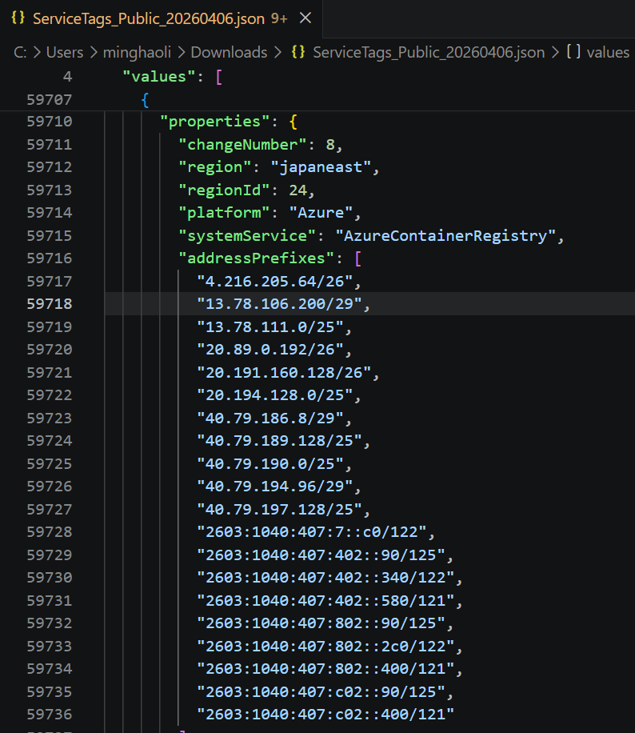
- 点击 **Save**

  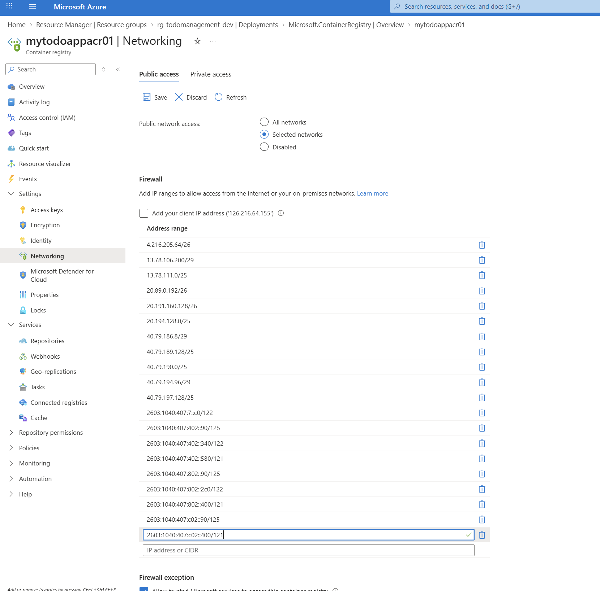

#### 选项 B: 在 VNet 中创建代理池

参考: [在 ACR Tasks 中创建和管理代理池](https://learn.microsoft.com/en-us/azure/container-registry/tasks-agent-pools)

1. 打开 Azure Cloud Shell 并运行以下命令

   ```powershell
   # 替换为步骤 1.1 中的 Resource Group 名称
   $resourceGroupName = "rg-todomanagement-dev"
   # 替换为步骤 1.2 中的 Virtual Network 名称
   $vNetName = "vnet-todomanagement-dev"
   $subnetName = "snet-private-endpoints"
   # 替换为您的 Azure Container Registry 名称
   $registryName = "mytodoappacr01"
   $agentPoolName = "myagentpool"
   # 获取子网 ID
   $subnetId=$(az network vnet subnet show --resource-group $resourceGroupName --vnet-name $vNetName --name $subnetName --query id --output tsv)
   az acr agentpool create --registry $registryName --name $agentPoolName --tier S1 --subnet-id $subnetId
   ```

**接下来: 记下您的 ACR 名称 (不含 `.azurecr.io`)**

---

### 步骤 1.4: 创建 Azure Container Apps Environment 和占位符容器应用

参考: [使用 Container Apps 创建您的第一个容器应用 - Azure Portal (MS Learn)](https://learn.microsoft.com/en-us/azure/container-apps/quickstart-portal)

首先创建 API Container App。此步骤还会创建 Container Apps Environment。

1. 在 Azure Portal 中，进入 **Home** > 搜索 **Container Apps**
2. 点击 **Create** > **Container App**
   
3. 在 **Basics** 页面:

   - **Project details**:
     - **Subscription**: 选择您的订阅
     - **Resource group**: 从步骤 1.1 中选择 Resource Group
     - **Container app name**: 输入 `app-todomanagement-api`
     - 其他设置保持默认值
       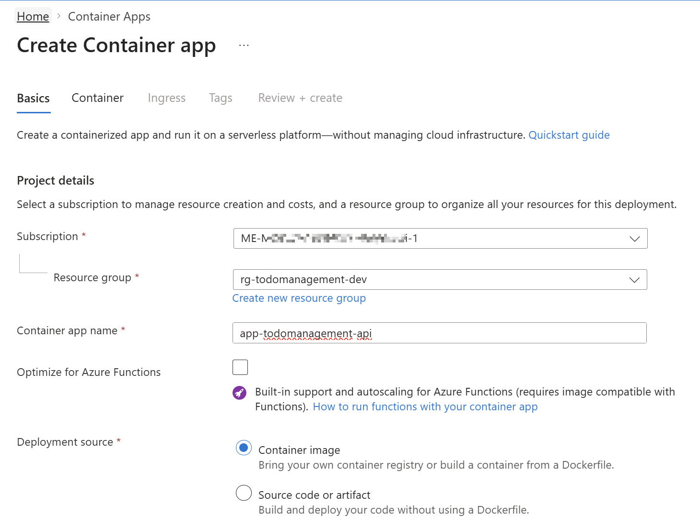
   - **Container Apps environment**:
     - **Region**: 与 Resource Group 相同的区域
     - 对于 **Container Apps environment**，点击 **Create new environment**
       在 **Create Container Apps environment** 对话框中:
       1. 在 **Basics** 页面:

          - **Environment name**: 输入名称 (示例: `cae-todomanagement-dev`)
          - 其他设置保持默认值
       2. 在 **Monitoring** 页面:

          - **Logs Destination**: 选择 **Azure Log Analytics**
          - **Log Analytics workspace**: 点击 **Create new**
            - **Name**: 输入名称 (示例: `law-todomanagement-dev`)
            - 点击 **OK**

          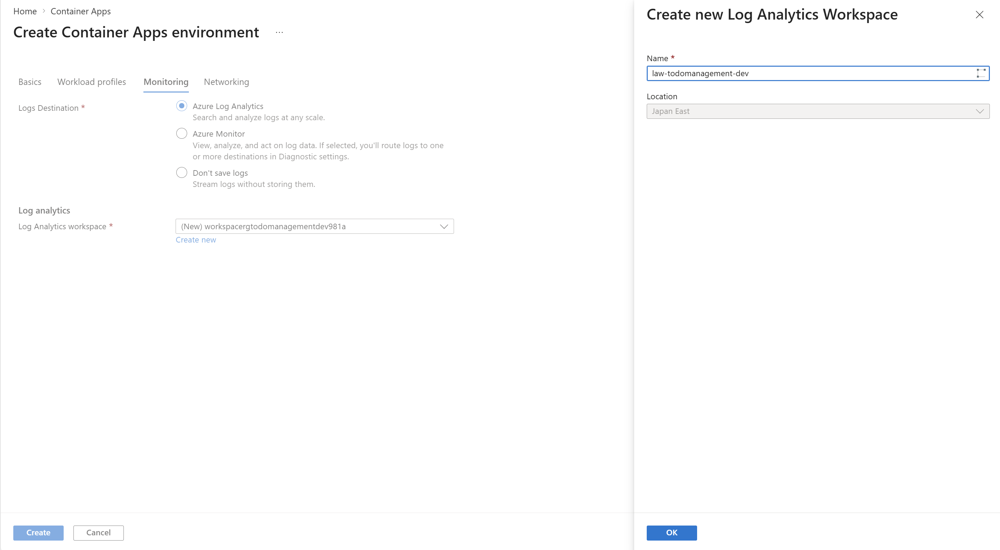
       3. 在 **Networking** 页面:

          - **Public Network Access**: 选择 **Enabled**，因为您将在后期步骤中验证应用
          - **Use your own virtual network**: 选择 `Yes`，然后指定步骤 1.2 中的虚拟网络和子网
          - 其他设置保持默认值

          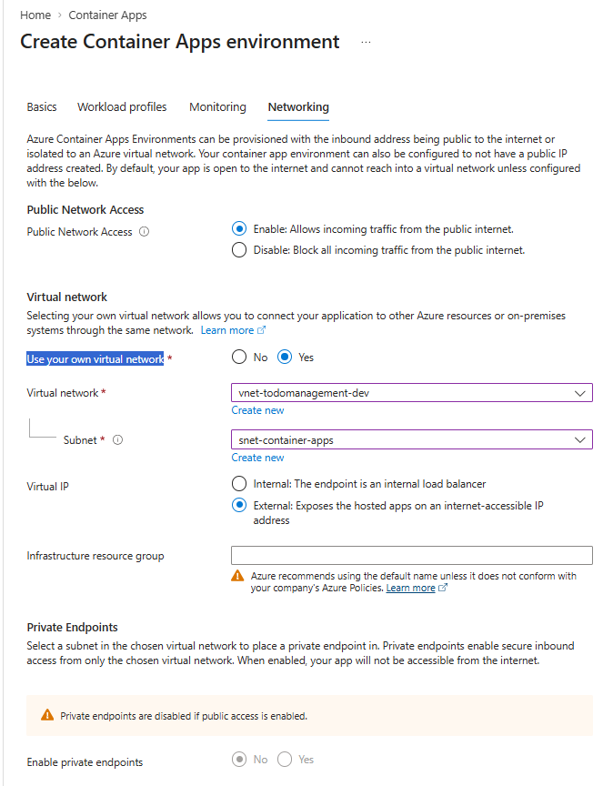
       4. 点击 **Create**

          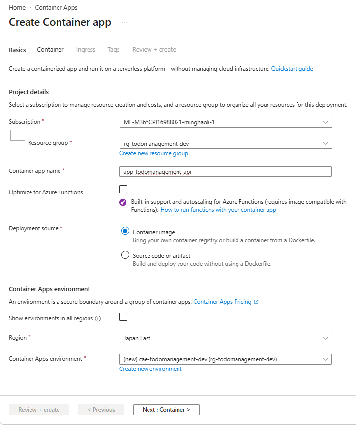
4. 点击 **Next: Container**
5. 在 **Container** 页面:

   - **Name**: 输入 `app-todomanagement-api`
   - **Image source**: 选择 `Docker Hub or other registries`
   - **Image type**: 选择 `Public`
   - **Registry login server**: 输入 `mcr.microsoft.com`
   - **Image and tag**: 输入 `k8se/quickstart:latest`
   - 其他设置保持默认值

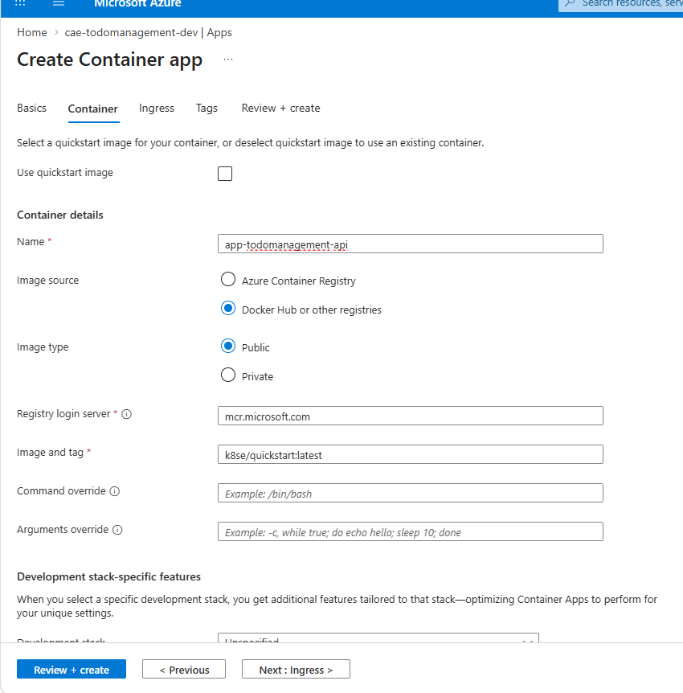

> 注: 在此步骤中，您正在创建占位符 Container App。实际镜像将在后期通过 GitHub Actions 部署。

6. 点击 **Next: Ingress**
7. 在 **Ingress** 页面:
   - **Ingress**: 确保已启用
   - **Target port**: 输入 `80`
   - 其他设置保持默认值
     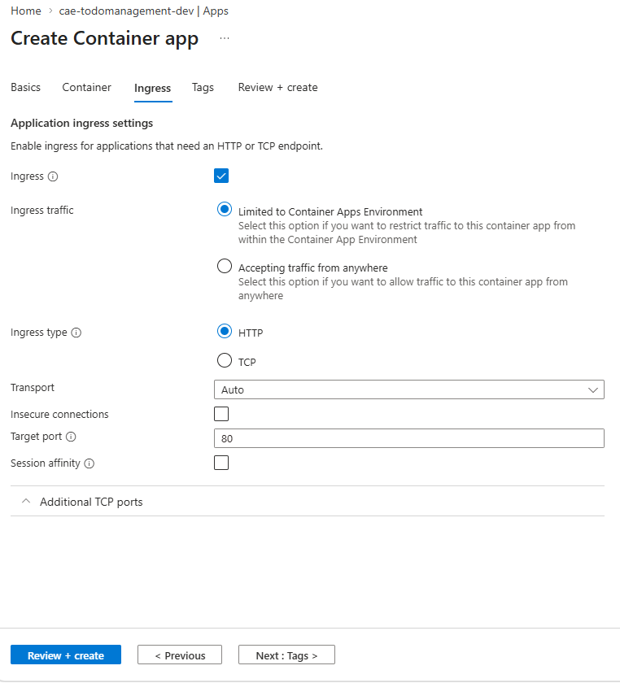
8. 点击 **Review + Create** -> **Create**
9. 等待部署 (通常 4-5 分钟)
10. 部署完成后，点击 **Go to resource** 导航到创建的应用
11. 在 **Overview** 页面，记下 API 应用的 **Application URL** (示例: `https://app-todomanagement-api.internal.politebay-d0fe95ab.japaneast.azurecontainerapps.io`)

接下来: 记下您的 Container Apps Environment 名称和 API 应用 Application URL

重复相同步骤以创建 Web Container App。

1. 在 Azure Portal 中，进入 **Home** > 搜索 **Container Apps**
2. 点击 **Create** > **Container App**
   
3. 在 **Basics** 页面:

   - **Project details**:
     - **Subscription**: 选择您的订阅
     - **Resource group**: 从步骤 1.1 中选择 Resource Group
     - **Container app name**: 输入 `app-todomanagement-web`
     - 其他设置保持默认值
   - **Container Apps environment**:
     - **Region**: 与 Resource Group 相同的区域 (示例: `Japan East`)
     - **Container Apps environment**: 选择在前一步骤中创建的 Container Apps Environment (示例: `cae-todomanagement-dev`)
       
4. 点击 **Next: Container**
5. 在 **Container** 页面:

   - **Name**: 输入 `app-todomanagement-web`
   - **Image source**: 选择 `Docker Hub or other registries`
   - **Image type**: 选择 `Public`
   - **Registry login server**: 输入 `mcr.microsoft.com`
   - **Image and tag**: 输入 `k8se/quickstart:latest`
   - **CPU and memory**: 选择 `0.25 CPU cores, 0.5 Gi memory`
   - 其他设置保持默认值

   > 注: 在此步骤中，您正在创建占位符 Container App。实际镜像将在后期通过 GitHub Actions 部署。
   >
6. 点击 **Next: Ingress**
7. 在 **Ingress** 页面:

   - **Ingress**: 确保已启用
   - **Ingress traffic**: 选择 `Accepting traffic from anywhere`
   - **Target port**: 输入 `80`
   - 其他设置保持默认值
     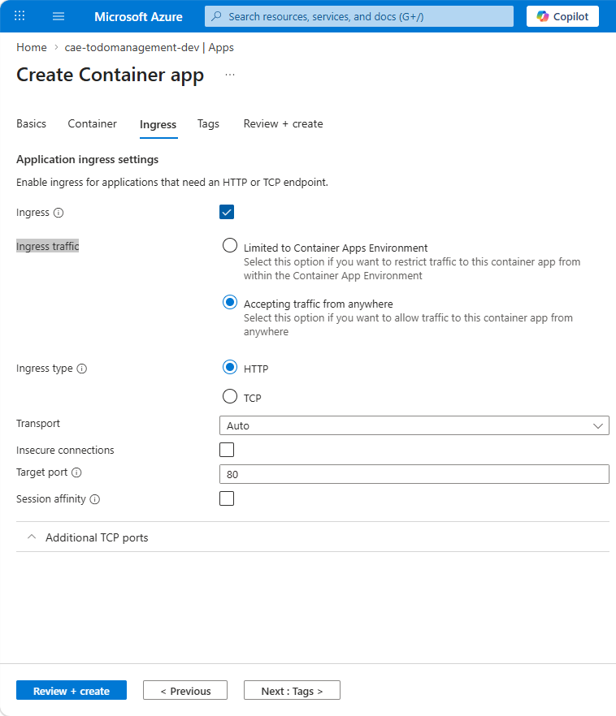
8. 点击 **Review + Create** -> **Create**
9. 等待部署 (通常 1-2 分钟)
10. 部署完成后，点击 **Go to resource** 导航到创建的应用
11. 在 **Overview** 页面，记下 Web 应用的 **Application URL** (示例: `https://app-todomanagement-web.politebay-d0fe95ab.japaneast.azurecontainerapps.io`)

接下来: 保留 Web Application URL 用于步骤 1.8 和 3.3

---

### 步骤 1.5: 创建 Azure Database for PostgreSQL Flexible Server

参考: [创建服务器 - Azure Database for PostgreSQL Flexible Server (MS Learn)](https://learn.microsoft.com/en-us/azure/postgresql/flexible-server/quickstart-create-server-portal)

1. 在 Azure Portal 中，进入 **Home** > 搜索 **Azure Database for PostgreSQL flexible servers**
2. 点击 **Create**
3. 在 **Create Azure Database for PostgreSQL Flexible Server** 页面:
   - **Subscription**: 选择您的订阅
   - **Resource group**: 从步骤 1.1 中选择 Resource Group
   - **Server name**: 输入名称 (示例: `pg-todomanagement-dev`)
   - **Region**: 与 Resource Group 相同的区域
   - **PostgreSQL version**: 选择 `17`
   - **Workload type**: 选择 `Development`
   - **Compute + storage**: 为开发保持默认值
   - **Authentication method**: 选择 `Microsoft Entra authentication only`
   - **Microsoft Entra administrator**: 选择您的用户。
     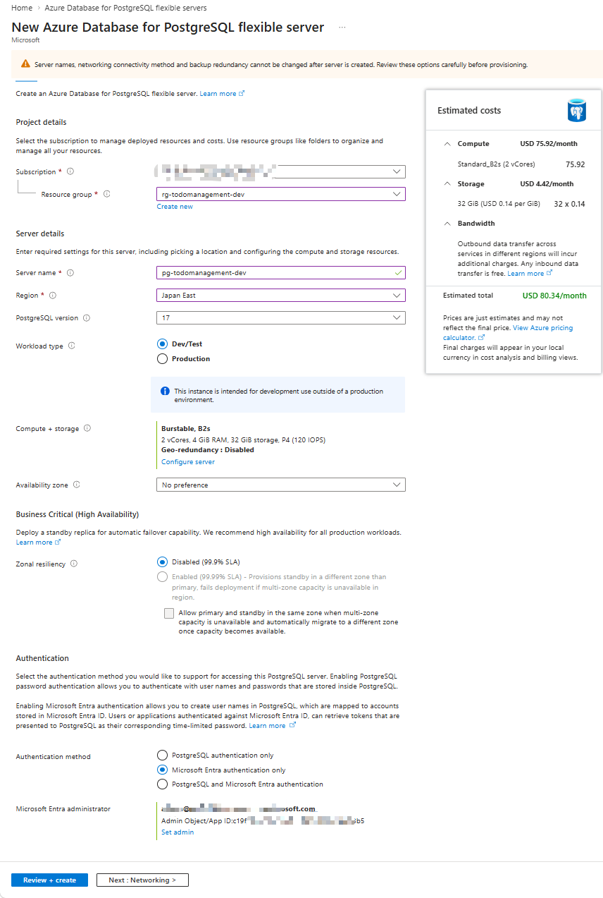
4. 点击 **Next: Networking**
5. 在 **Networking** 页面:
   - **Connectivity method**: 选择 `Private access (VNet Integration)` (出于安全考虑推荐)
   - **Virtual network**:
     - **Subscription**: 选择您的订阅
     - **Virtual network**: 从步骤 1.2 中选择 VNet (例: `vnet-todomanagement-dev`)
     - **Subnet**: 选择 `snet-postgresql` (步骤 1.2)
   - **Private DNS integration**:
     - **Subscription**: 选择您的订阅
     - **Private DNS zone**: 选择 `(New) privatelink.postgres.database.azure.com`。如果同名的私有区域已存在，Azure 可能显示例如 `(New) pg-todomanagement-dev.private.postgres.database.azure.com` 的区域。
       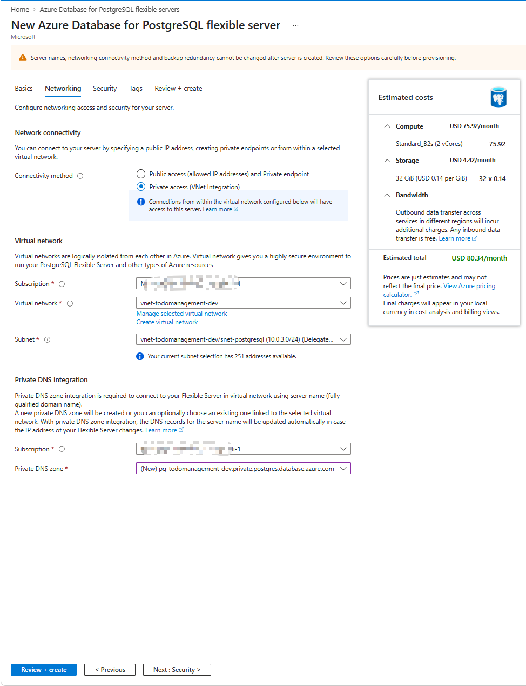
6. 点击 **Review + Create** -> **Create**
7. 等待部署 (通常 5-10 分钟)

**接下来: 记下:**

- PostgreSQL 服务器端点 (例: `pg-todomanagement-dev.postgres.database.azure.com`)

---

### 步骤 1.6: 创建用户分配托管标识

参考: [创建用户分配托管标识 - Azure Portal (MS Learn)](https://learn.microsoft.com/en-us/azure/active-directory/managed-identities-azure-resources/how-manage-user-assigned-managed-identities?tabs=azure-portal)

此标识将由 API 容器用于访问 PostgreSQL。

1. 在 Azure Portal 中，进入 **Home** > 搜索 **Managed Identities**
2. 点击 **Create**
3. 在 **Create User Assigned Managed Identity** 页面:
   - **Subscription**: 选择您的订阅
   - **Resource group**: 从步骤 1.1 中选择 Resource Group
   - **Region**: 与 Resource Group 相同的区域
   - **Name**: 输入名称 (示例: `uai-todomanagement-api`)
     
4. 点击 **Review + Create** -> **Create**
5. 等待部署 (通常 1-5 秒)
6. 点击新创建的托管标识将其打开

**接下来: 记下:**  

   - **Client ID** (Overview 下)
   - **Resource ID** (Properties 下)

---

### 步骤 1.7: 配置 PostgreSQL 数据库和权限

参考: [配置服务器参数 - Azure Database for PostgreSQL (MS Learn)](https://learn.microsoft.com/en-us/azure/postgresql/flexible-server/concepts-server-parameters)

1. 在 Azure Portal 中，进入您的 PostgreSQL 服务器 (步骤 1.5)
2. 在左侧菜单中，点击 **Databases**
3. 点击 **Add**
4. 输入数据库名称: `tododb`
5. 点击 **Save**
6. 等待数据库创建 (通常 1-2 分钟)

**授予托管标识访问 PostgreSQL 数据库权限:**

1. 在 Azure Portal 中，进入您的 PostgreSQL 服务器
2. 在左侧菜单中，点击 **Security** -> **Authentication**
3. 点击 **Add Microsoft Entra administrators**。在 **Select Microsoft Entra administrators** 对话框中，搜索前一步骤创建的托管标识 (示例: `uai-todomanagement-api`) 并点击 **Select**
   
4. 点击 **Save** 并等待配置应用

> 注: 最小权限数据库角色设计超出本动手指南范围。有关为 Microsoft Entra 主体创建数据库用户和授予角色的本生产指导，请参阅 [Manage Microsoft Entra Users - Azure Database for PostgreSQL | Microsoft Learn](https://learn.microsoft.com/en-us/azure/postgresql/security/security-manage-entra-users)。

---

### 步骤 1.8: 创建 Microsoft Entra ID 应用注册

参考: [注册应用程序 - Microsoft Entra ID (MS Learn)](https://learn.microsoft.com/en-us/azure/active-directory/develop/quickstart-register-app)

此应用注册使 Web 用户能够用其 Microsoft Entra ID 账户登录。

1. 在 Azure Portal 中打开 **Microsoft Entra ID** (或搜索)
2. 在左侧菜单中，点击 **App registrations**
3. 点击 **New registration**
4. 在 **Register an application** 页面:
   - **Name**: 输入名称 (示例: `todo-web-app`)
   - **Supported account types**: 选择 **Accounts in this organizational directory only**
   - **Redirect URI**: 选择 `Single-page application (SPA)` 并输入步骤 1.4 中创建的 Web Container App 的 **Application URL** (示例: `https://app-todomanagement-web.politebay-d0fe95ab.japaneast.azurecontainerapps.io`)
5. 点击 **Register**
   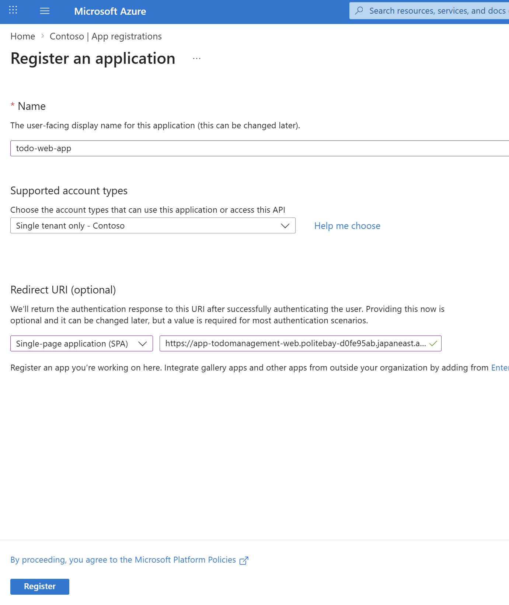
6. 应用已注册。记下:
   - **Application (client) ID** (Overview 页面)
   - **Directory (tenant) ID** (Overview 页面)

---

### 步骤 1.9: 汇总 - 收集所有资源详情

进入阶段 2 前，从您的 Azure 资源收集以下所有信息:

- **Subscription ID**: `xxxxxxxx-xxxx-xxxx-xxxx-xxxxxxxxxxxx`
- **Resource Group**: `rg-todomanagement-dev`
- **Virtual Network**: `vnet-todomanagement-dev`
- **Container Apps Subnet**: `snet-container-apps`
- **Private Endpoints Subnet**: `snet-private-endpoints`
- **PostgreSQL Subnet**: `snet-postgresql`
- **ACR Name**: `mytodoappacr`
- **Container Apps Environment**: `cae-todomanagement-dev`
- **PostgreSQL Server**: `pg-todomanagement-dev.postgres.database.azure.com`
- **PostgreSQL Database**: `tododb`
- **Managed Identity Name**: `uai-todomanagement-api`
- **Managed Identity Client ID**: `xxxxxxxx-xxxx-xxxx-xxxx-xxxxxxxxxxxx`
- **Managed Identity Resource ID**: `/subscriptions/.../resourceGroups/.../providers/Microsoft.ManagedIdentity/userAssignedIdentities/uai-todomanagement-api`
- **Entra ID App Client ID**: `xxxxxxxx-xxxx-xxxx-xxxx-xxxxxxxxxxxx`
- **Entra ID App Tenant ID**: `xxxxxxxx-xxxx-xxxx-xxxx-xxxxxxxxxxxx`
- **Web Container App URL**: `https://app-todomanagement-web.<region>.azurecontainerapps.io`
- **API Container App URL**: `https://app-todomanagement-api.internal.<region>.azurecontainerapps.io`

---

## 阶段 2: 创建存储库

> 预计耗时: 5-10 分钟

现在您的 Azure 基础设施已准备好，创建您的 GitHub 存储库。

### 步骤 2.1: 从模板创建存储库

参考: [从模板创建存储库 (GitHub 文档)](https://docs.github.com/en/repositories/creating-and-managing-repositories/creating-a-repository-from-a-template)

1. 打开模板存储库
2. 点击 **Use this template** -> **Create a new repository**
3. 设置:
   - **Repository name**: 例如 `my-todo-app`
   - **Visibility**: `Public` (在此培训工作流中推荐)
4. 点击 **Create repository from template**
5. 等待存储库创建

---

## 阶段 3: 配置 GitHub Actions 并部署

> 预计耗时: 15-20 分钟

首先用您的 Azure 认证信息和资源详情配置 GitHub Actions，然后启用工作流文件以避免空的或失败的初期运行。

### 步骤 3.1: 创建 Azure Service Principal 和认证信息

参考: [创建 Azure Service Principal (MS Learn)](https://learn.microsoft.com/en-us/azure/developer/github/publish-docker-container)

1. 在 Azure Portal 中打开 **Azure Cloud Shell**
2. 运行此命令以创建注册到 Resource Group 的 Service Principal:

   ```powershell
   # 检查当前订阅
   az account show

   # 切换到不同订阅 (如需)
   # 将 `<subscription-id>` 替换为阶段 1 汇总 (步骤 1.9) 中的订阅 ID。
   az account set --subscription "<subscription-id>"

   # 设置变量
   $subscriptionId = $(az account show --query id -o tsv)
   $spName = "github-todomanagement-ci"
   # 替换为阶段 1 汇总 (步骤 1.9) 中的 Resource Group 名 (如果您更改了)。
   $resourceGroupName = "rg-todomanagement-dev"
   # 创建 Service Principal
   $sp = az ad sp create-for-rbac `
   --name $spName `
   --role "Owner" `
   --scopes "/subscriptions/$subscriptionId/resourceGroups/$resourceGroupName" `
   --json-auth | ConvertFrom-Json

   # 作为 JSON 输出 (供稍后使用)
   $sp | ConvertTo-Json
   ```

3. 复制 JSON 输出 (完整的 `{...}` 块)

**注:** 此 JSON 输出是敏感信息。妥善保管。

---

### 步骤 3.2: 添加 GitHub Actions 机密

1. 在您的 GitHub 存储库中，转到 **Settings**
2. 在左侧菜单中，点击 **Secrets and variables** > **Actions**
3. 点击 **New repository secret**
4. **Name**: `AZURE_CREDENTIALS`
5. **Secret**: 粘贴步骤 3.1 中的 JSON 输出
6. 点击 **Add secret**
   

---

### 步骤 3.3: 添加 GitHub 存储库变量

参考: [在 GitHub Actions 中使用变量 (GitHub 文档)](https://docs.github.com/en/actions/learn-github-actions/variables)

在您的 GitHub 存储库 **Settings** > **Secrets and variables** > **Actions** 中，点击 **Variables**，并添加这些存储库变量:

| 变量                             | 值                                     | 参考     |
| ------------------------------------ | ---------------------------------------- | ------------- |
| `RESOURCE_GROUP`                     | 您的 Resource Group 名称                 | 步骤 1.9 |
| `ACR_NAME`                           | 您的 ACR 名称 (不含 `.azurecr.io`)       | 步骤 1.9 |
| `CONTAINER_APP_ENVIRONMENT`          | 您的 Container Apps Environment 名称     | 步骤 1.9 |
| `POSTGRES_SERVER`                    | 您的 PostgreSQL 服务器 FQDN              | 步骤 1.9 |
| `POSTGRES_USER`                      | 您的用户分配托管标识名称                 | 步骤 1.9 |
| `POSTGRES_DB`                        | `tododb`                                 | 固定值   |
| `DATABASE_TYPE`                      | `postgresql`                             | 固定值   |
| `AZURE_CLIENT_ID`                    | Entra ID App Client ID                   | 步骤 1.9 |
| `AZURE_TENANT_ID`                    | Entra ID App Tenant ID                   | 步骤 1.9 |
| `USER_ASSIGNED_IDENTITY_CLIENT_ID`   | 托管标识 Client ID                       | 步骤 1.9 |
| `USER_ASSIGNED_IDENTITY_RESOURCE_ID` | 托管标识 Resource ID                     | 步骤 1.9 |
| `AZURE_REDIRECT_URI`                 | 您的 Web Container App URL               | 步骤 1.9 |
| `API_PROXY_TARGET`                   | 您的内部 API Container App URL           | 步骤 1.9 |
| `REPOSITORY`                         | 您的存储库 URL                           | 步骤 2.1 |

---

### 步骤 3.4: 准备工作流文件

参考: [GitHub Actions 文档](https://docs.github.com/en/actions)

配置了机密和变量后，启用工作流文件。

在您的存储库中，CI/CD 工作流文件以模板形式提供:

- `.github/workflows/build-deploy-api.yml.template` → 重命名为 `build-deploy-api.yml`
- `.github/workflows/build-deploy-web.yml.template` → 重命名为 `build-deploy-web.yml`

要创建文件:

1. 在 Azure Portal 中打开 **Azure Cloud Shell**
2. 运行此命令:

```powershell
git clone <your-repo-url>
cd my-todo-app

# 复制模板并去掉 .template 扩展名
cp .github/workflows/build-deploy-api.yml.template .github/workflows/build-deploy-api.yml
cp .github/workflows/build-deploy-web.yml.template .github/workflows/build-deploy-web.yml

# 提交并推送
git add .github/workflows/*.yml
git commit -m "Enable API and Web build-deploy workflows"
git push origin main
```

---

### 步骤 3.5: 运行 GitHub Actions 工作流

1. 在您的存储库中，转到 **Actions** 标签
2. 您应该看到两个工作流：
   - `Build and Deploy API to ACR`
   - `Build and Deploy Web to ACR`
3. 如果工作流未显示，确保:
   - `.github/workflows/build-deploy-api.yml` 和 `.github/workflows/build-deploy-web.yml` 已提交到 `main`
4. 工作流应在 `main` 分支提交时自动触发
5. 点击每个工作流进行监视:
   - 检查是否有 **红色 X** (失败) 或 **绿色复选标记** (成功)
   - 两者应在 5-10 分钟内完成

**工作流失败疑难排解:**

- 验证 **AZURE_CREDENTIALS** 包含 `az ad sp create-for-rbac --json-auth` 的有效 JSON
- 确保所有变量已填充
- 确认 Azure 资源存在且名称完全匹配

---

## 阶段 4: 验证部署

> 预计耗时: 10 分钟

### 步骤 4.1: 验证 Container App 部署

1. 在 Azure Portal 中，转到您的 **Container Apps Environment**
2. 您应该看到两个容器应用:
   - `app-todomanagement-api`
   - `app-todomanagement-web`
3. 点击 `app-todomanagement-web` 并记下 Web 应用的 **URL**
4. 点击 `app-todomanagement-api` 并记下内部 API 的 **URL**

---

### 步骤 4.2: 验证 Entra ID 重定向 URI

重定向 URI 应已与您在步骤 1.8 中注册的 Web Container App URL 匹配。在此验证它，仅在需要时更新。

1. 转到您的 **Entra ID App 注册** (步骤 1.8)
2. 点击 **Authentication**
3. 确认 SPA 重定向 URI 与步骤 4.1 中的 Web Container App URL 匹配
4. 如需添加或更新，使用 `https://<your-web-url>`
   - 将 `<your-web-url>` 替换为步骤 4.1 中的 Web 应用 URL
   - 不要附加 `/callback`
5. 勾选 **Access tokens** 和 **ID tokens** 复选框
6. 点击 **Save**

---

### 步骤 4.3: 验证 Web 和 API URL 的 GitHub 变量

返回您的存储库 **Settings** > **Secrets and variables** > **Actions**:

1. 点击 **Variables**
2. 找到 `AZURE_REDIRECT_URI` 并点击 **Edit**
   - 确认值为 `https://<your-web-url>`
   - 点击 **Update variable**
3. 找到 `API_PROXY_TARGET` 并点击 **Edit**
   - 确认值为步骤 4.1 中的内部 API URL: `https://<your-api-url>`
   - 点击 **Update variable**

如果这些值已与步骤 3.3 中设置的值匹配，则无需更改。

---

### 步骤 4.4: 测试应用程序

1. 在浏览器中打开 Web 应用 URL
2. 点击 **Login**
3. 用您的 Microsoft Entra ID 凭证登录
4. 登录后，您应看到 **Todo List** 页面
5. 测试功能:
   - **创建**: 添加新 TODO 项，点击保存
   - **编辑**: 点击 TODO 项进行编辑
   - **删除**: 点击删除按钮移除 TODO 项
   - **刷新**: 页面刷新后所有更改应被保留

**如果登录失败:**

- 确认 Entra ID 重定向 URI 正确
- 确认 `AZURE_CLIENT_ID` 和 `AZURE_TENANT_ID` 正确
- 检查浏览器控制台的错误详情 (F12 > Console)

**如果 API 无响应:**

- 确认 PostgreSQL 数据库可访问
- 确认托管标识拥有数据库权限
- 检查 Container Apps 中 API 容器的日志

---

## 完成汇总

您的 Todo Management 应用已在 Azure 上部署。

**已部署内容:**

- ✅ 具有 TODO schema 的 PostgreSQL 数据库
- ✅ Azure Container Apps 中的 API 容器
- ✅ Azure Container Apps 中的 Web 容器
- ✅ 通过 Microsoft Entra ID 的用户认证
- ✅ 通过 GitHub Actions 的 CI/CD 管道

**后续步骤:**

- 在 Azure Application Insights 中监视应用
- 在 `DEPLOY_GUIDE.md` 中学习 IaC 方式
- 为您的组织定制应用程序

---

## 常见问题和疑难排解

### 工作流无法登录到 Azure

**错误**: `Error: Unable to login with service principal`

**解决方案:**

- 验证 `AZURE_CREDENTIALS` 机密包含 `az ad sp create-for-rbac --json-auth` 的有效 JSON
- 检查 JSON 未被截断或损坏
- 如需要，重新创建 Service Principal: `az ad sp create-for-rbac --name "github-actions-todoapp" --role Contributor --scopes /subscriptions/<SUBSCRIPTION_ID> --json-auth`

### API 无法连接到 PostgreSQL

**错误**: `could not translate host name "pg-..." to address`

**解决方案:**

- 验证 `POSTGRES_SERVER` 变量与 PostgreSQL 服务器主机名完全匹配
- 验证 PostgreSQL 服务器连接到正确的 VNet、子网和私有 DNS 区域
- 验证托管标识拥有预期的数据库权限
- 验证 `POSTGRES_USER` 设置为托管标识名称，不是 `postgres`

### Web 登录失败或显示错误

**错误**: `AADSTS50058: Silent sign-in request failed`

**解决方案:**

- 验证 `AZURE_CLIENT_ID` 和 `AZURE_TENANT_ID` 正确
- 验证 `AZURE_REDIRECT_URI` 与 Entra ID 中注册的确切 URL 匹配 (步骤 4.2)
- 确保 Entra ID 中的重定向 URI 具有 `https://` scheme
- 确认 Entra ID 中启用了访问令牌和 ID 令牌 (步骤 4.2)

### Container Apps 未显示部署

**错误**: 在 Container Apps Environment 中看不到 `app-todomanagement-api` 或 `app-todomanagement-web`

**解决方案:**

- 验证 GitHub Actions 工作流成功完成 (无红色 X)
- 验证 ACR 有新镜像: 转到 Container Registry > Repositories
- 如无镜像，工作流可能失败 - 检查工作流日志的错误
- 验证 `ACR_NAME` 和 `RESOURCE_GROUP` 完全匹配，无空格

---

## 后续步骤

- **初学者路径完毕:** 您的应用已准备使用!
- **高级路径:** 在 `DEPLOY_GUIDE.md` 中学习 Infrastructure as Code
  - Azure Portal -> **Managed identities** -> **User assigned** -> **Create**

### 3.2 截图占位说明 (后续替换为真实截图)

先使用以下占位，后续补充真实截图：


Portal path: Resource groups -> Create


Portal path: Container registries -> Create


Portal path: Container Apps -> Environments -> Create


Portal path: Azure Database for PostgreSQL flexible servers -> Create


Portal path: Microsoft Entra ID -> App registrations -> New registration


Portal path: Managed identities -> User assigned -> Create

---

## 第 4 步: 配置 PostgreSQL 访问

1. 创建数据库 `tododb`。
2. 配置网络访问，确保 API 可连接数据库。
3. 为托管标识主体授予所需权限。

说明:
- 初学者路径中，应用注册和身份相关操作建议使用 Azure Portal 或 Azure CLI。
- 不建议在该路径中依赖 Bicep 完成应用注册。

---

## 第 5 步: 配置 GitHub Actions Secret 和 Variables

在仓库中打开:

- **Settings** -> **Secrets and variables** -> **Actions**

Secret:

- `AZURE_CREDENTIALS`: 使用 `az ad sp create-for-rbac --json-auth` 获取的 JSON

Repository variables:

- `ACR_NAME`
- `RESOURCE_GROUP`
- `CONTAINER_APP_ENVIRONMENT`
- `POSTGRES_SERVER`
- `POSTGRES_DB` (默认 `tododb`)
- `POSTGRES_USER` (托管标识主体，不可使用 `postgres`)
- `DATABASE_TYPE` (`postgresql`)
- `AZURE_CLIENT_ID` (Microsoft Entra ID 应用 Client ID)
- `AZURE_TENANT_ID` (Microsoft Entra ID Tenant ID)
- `AZURE_REDIRECT_URI` (Web URL)
- `API_PROXY_TARGET` (internal API URL)
- `USER_ASSIGNED_IDENTITY_CLIENT_ID`
- `USER_ASSIGNED_IDENTITY_RESOURCE_ID`

---

## 第 6 步: 推送代码并触发 GitHub Actions

1. 提交 Workflow 文件和配置变更。
2. 推送到 `main`。
3. 在 **Actions** 页面确认以下两个 Workflow 运行:
   - `Build and Deploy API to ACR`
   - `Build and Deploy Web to ACR`

---

## 第 7 步: 验证部署结果

1. 打开部署输出中的 Web URL。
2. 点击 **Login**，使用 Microsoft Entra ID 登录。
3. 验证 Todo 的创建、编辑、删除。

---

## 常见问题

- Workflow 无法登录 Azure:
  - 检查 `AZURE_CREDENTIALS` JSON 格式和授权范围
- API 无法连接 PostgreSQL:
  - 检查 `POSTGRES_SERVER`、身份权限和网络设置
- Web 登录失败:
  - 检查 `AZURE_CLIENT_ID`、`AZURE_TENANT_ID`、`AZURE_REDIRECT_URI`

---

## 下一步

- 初学者路径: 使用本 GUI 指南
- 进阶路径: 参考 IaC 指南 `DEPLOY_GUIDE-zh_CN.md`

创建时间: 2026-04-10
版本: 1.0
